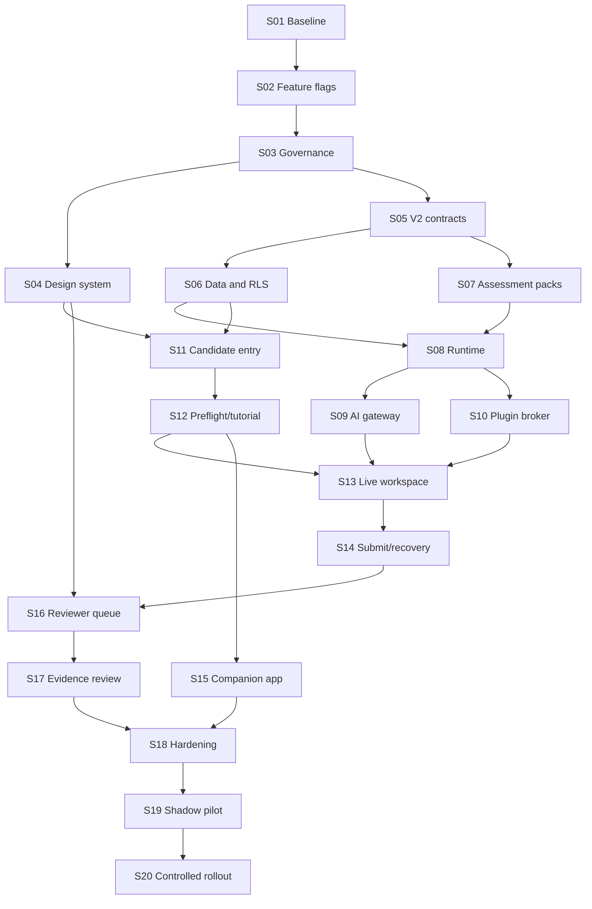
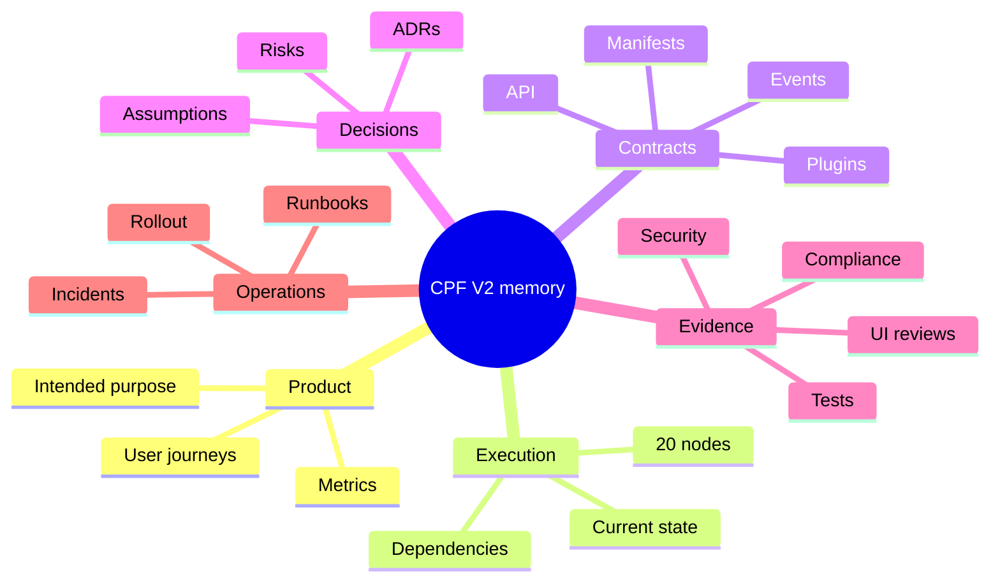

# CPF 2.0 — 20-Step Conflict-Safe Integration and Execution Plan

**Candidate V2, Reviewer V2, controlled AI workspaces, sandbox plugins, proctor companion, business logic and EU assurance**  
**Prepared:** 3 August 2026  
**Repository:** [ANSHU-Ireland/CPF-2.0](https://github.com/ANSHU-Ireland/CPF-2.0)  
**Companion specification:** `CPF_AI_Native_Hiring_Blueprint_2026.md`

> This plan is designed to integrate alongside the current system without a big-bang rewrite. Existing Super Admin, Employer Admin, identity, tenancy, row-level security, audit, data-rights and V1 assessment behaviour remain operational until V2 passes shadow-mode validation. It is a product and engineering plan, not legal advice.

## Executive decision

**Outcome: NOT READY for live candidate decisions today.** The system can move to **READY FOR CONTROLLED PILOT** after Steps 1–19 pass their gates. Employment assessment AI is an Annex III high-risk use when it evaluates applicant responses and materially affects recruitment. Human involvement does not remove that classification where the AI materially influences selection. The EU high-risk employment requirements now apply from 2 December 2027 following Regulation (EU) 2026/1744, while GDPR, equality, employment, transparency and security duties already apply. ([European Commission AI Act framework](https://digital-strategy.ec.europa.eu/en/policies/regulatory-framework-ai); [AI Act Service Desk employment examples](https://ai-act-service-desk.ec.europa.eu/en/employment-0))

The integration strategy is:

- keep the modular monolith and existing stack;
- add V2 contracts, tables and feature modules rather than mutating V1 in place;
- run Candidate V1 and V2, and Reviewer V1 and V2, side by side;
- route by tenant flag, assessment-pack version and session manifest;
- use additive database migrations and dual-read/dual-write only where necessary;
- keep AI suggestions, integrity information and human assessment decisions separate;
- make every step a small, reviewable PR with acceptance, migration and rollback evidence;
- preserve one authoritative execution graph so humans and coding agents do not lose context.

## 1. Execution rules that prevent conflicts

### 1.1 Non-negotiable compatibility rules

1. Existing V1 endpoints and active sessions cannot change semantics during Steps 1–19.
2. New candidate and reviewer behaviour lives under `/v2`, V2 feature folders and V2 database projections.
3. An invitation is permanently bound to one assessment-pack version, notice version, rubric version and runtime manifest.
4. A session started in V1 never moves to V2; a V2 session never falls back silently to V1.
5. All schema changes are additive until V2 has completed two stable releases and V1 retirement is separately approved.
6. RLS is required on every tenant/candidate table before an API endpoint can access it.
7. Performance evidence and integrity evidence use separate permissions, projections, reviewer tabs and retention rules.
8. No AI component produces `hire`, `reject`, `pass`, `fail`, `rank`, `fit` or a universal candidate score.
9. An AI, model, prompt, rubric, plugin or policy version cannot change inside an active session.
10. A technical or proctoring interruption pauses safely; it cannot automatically invalidate a candidate.

### 1.2 Branch and PR discipline

Use one PR per execution step. Branches follow `cpf-v2/SNN-short-name`; migrations follow `NNNN_v2_<purpose>.sql`; feature flags follow `candidate_v2`, `reviewer_v2`, `assessment_runtime_v2`, `proctor_companion`. Each PR includes:

- dependency node IDs from the execution graph;
- files intentionally changed and files explicitly out of scope;
- API/schema/event changes;
- tests and commands run;
- UI states/screenshots where applicable;
- security, privacy, accessibility and AI-control impact;
- migration and rollback/disable path;
- evidence links and unresolved risk.

Never mix a large UI redesign, destructive migration and changed scoring behaviour in one PR.

### 1.3 Current repository anchors confirmed

| Current anchor | Current behaviour | Integration rule |
|---|---|---|
| Root `package.json` | Node ≥22, npm workspaces under `packages/*` and `apps/*`; framework/identity/AI gateway build before API | Add packages/apps without changing existing workspace names or root command semantics |
| `apps/web/src/main.tsx` | Candidate V1 at `/candidate/:token`; Reviewer V1 at `/org/:orgId/reviews...`; Employer/platform/learning routes share the authenticated shell | Add explicit V2 routes; candidates keep a dedicated non-employer shell |
| `CandidatePortalPage.tsx` | V1 notices/accommodation, textarea work, 60-second event save, visibility events, V1 submit/data-rights | Keep for V1 characterization; V2 feature module uses artifact/runtime contracts rather than growing this file |
| `ReviewQueuePage.tsx` | Existing organisation review queue | Keep for V1; V2 qualification/SLA/blind-review queue uses a new projection |
| `ReviewWorkspacePage.tsx` | Existing evidence/integrity tabs, claims, criteria scoring, adjudication and finalisation through V1 APIs | Reuse valid domain concepts, but rebuild UI/data projection under V2; do not duplicate finalisation rules accidentally |
| `packages/assessment-framework` | Existing assessment/scoring primitives | Extend through versioned adapters or new `assessment-packs`; do not alter invited V1 templates |
| `packages/ai-gateway` | Existing central AI boundary | Extend with assessment-scoped prompts/models/tools; never create direct client-to-model access |

The exact baseline commit is captured in Step 1. If a file moves before implementation, update the node's path inventory rather than creating a second copy at the old location.

## 2. Master execution graph



Critical path: `S01 → S02 → S03 → S05 → S06 → S08 → S09/S10 → S13 → S14 → S16 → S17 → S18 → S19 → S20`.

The UI track (`S04, S11, S12, S13, S16, S17`) is not a decorative layer. Its accessibility, state handling, transparency and usability gates can block release just like security or database work.

### 2.1 Twenty-step control table

| Step | Depends on | Primary output | Completion proof |
|---:|---|---|---|
| 1 | — | Baseline, memory graph, characterisation | Green V1 contracts/tests |
| 2 | 1 | Feature flags and V2 route seams | Feature-off equivalence |
| 3 | 2 | Classification, DPIA/control design | DPO/counsel/security decision |
| 4 | 3 | Design system and component states | Visual/accessibility evidence |
| 5 | 3 | V2 domain/API/event schemas | Consumer contract tests |
| 6 | 5 | Additive data/RLS/retention | Isolation/deletion/migration tests |
| 7 | 5 | Four immutable packs | SME/I-O approval and replay |
| 8 | 6, 7 | Runtime/artifact engine | State/concurrency/recovery tests |
| 9 | 8 | Controlled copilot | AI safety/task evaluation |
| 10 | 8 | Plugin broker/catalogue | Capability/egress contract tests |
| 11 | 4, 6 | Candidate entry/notices | Comprehension/accessibility UAT |
| 12 | 11 | Preflight/tutorial | Supported/failure-device E2E |
| 13 | 9, 10, 12 | Live role workspaces | Four-pack end-to-end evidence |
| 14 | 13 | Atomic finalisation/recovery | Duplicate/offline/crash tests |
| 15 | 12, 14 | Signed companion and shutdown | Pen test/signing/DPIA evidence |
| 16 | 4, 14 | Reviewer queue/calibration | Role/blind-review/SLO tests |
| 17 | 16 | Evidence review/adjudication | Reliability/workflow UAT |
| 18 | 15, 17 | Cross-system hardening | No open P0/P1; drills pass |
| 19 | 18 | Shadow validation | Pre-registered pilot gates pass |
| 20 | 19 | Controlled rollout | Signed release record/monitoring |

## 3. Execution memory and repository tree

### 3.1 Memory model



Create this durable memory inside the repository in Step 1:

```text
docs/execution/
  README.md
  execution-graph.yaml
  project-state.yaml
  assumptions.md
  risk-register.md
  decisions/
    ADR-001-v2-side-by-side.md
    ADR-002-no-autonomous-hiring.md
    ADR-003-integrity-separation.md
    ADR-004-secure-shell.md
  nodes/
    S01-baseline.md ... S20-controlled-rollout.md
  contracts/
    assessment-manifest.schema.json
    evidence-event.schema.json
    plugin-contract.schema.json
    shutdown-receipt.schema.json
  evidence/
    ui/ accessibility/ security/ ai-evals/ performance/ compliance/
  runbooks/
    model-outage.md
    plugin-outage.md
    companion-disconnect.md
    submission-recovery.md
    pack-suspension.md
```

### 3.2 Execution-node schema

Every `SNN` node has this structure so a person or coding agent can resume safely:

```yaml
id: S01
title: Baseline and freeze
status: not_started # not_started | in_progress | blocked | review | complete
depends_on: []
owner: platform-lead
allowed_paths: []
forbidden_paths: []
inputs: []
outputs: []
acceptance: []
tests: []
risks: []
decisions: []
evidence: []
rollback: ""
next_nodes: [S02]
updated_at: ""
updated_by: ""
```

`execution-graph.yaml` is the dependency source of truth. `project-state.yaml` records only current status and evidence pointers; it does not duplicate requirements. A node may enter `in_progress` only when all dependencies are `complete`. Completion requires linked evidence, not a prose assertion.

### 3.3 Target source tree

```text
apps/
  web/src/features/
    candidate-v2/
      entry/ notices/ accommodations/ preflight/ tutorial/ runtime/ submission/ rights/
    reviewer-v2/
      queue/ calibration/ workspace/ integrity/ adjudication/ appeals/
  api/src/modules/
    assessment-runtime/ artifacts/ tool-broker/ integrity/ review-v2/ adjudication/
  proctor-desktop/
    src-tauri/ src/ tests/
packages/
  assessment-packs/
  assessment-runtime/
  plugin-contracts/
  proctor-protocol/
  review-projections/
  design-system/
  db/
docs/execution/
```

Do not move existing pages immediately. V2 routes import feature modules; V1 pages remain unchanged until Step 20 retirement work is separately approved.

## Step 1 — Establish the baseline and execution memory

**Purpose:** make the current behaviour reproducible before changing it.

**Repository actions**

- Record current default-branch SHA, Node/npm versions, database migration head, environment-variable inventory and package dependency graph.
- Run and store results for root `build`, `typecheck`, `lint`, `test`, API integration tests and web build. Add missing commands to CI without changing behaviour.
- Snapshot OpenAPI/API response contracts for Candidate V1 and Reviewer V1.
- Add `docs/execution/` with the graph, node files, assumption ledger, risk register and ADR templates.
- Document protected modules: Super Admin, Employer Admin, identity, tenancy/RLS, audit and data-rights.
- Add a repository ownership map: Product, Web, API, DB, Desktop, Security, DPO/Legal, Accessibility and I-O Psychology.

**UI work:** capture current Candidate, Reviewer, Employer and Super Admin screens at 1440×900, 1280×720 and 200% zoom. Record—not yet fix—broken hierarchy, inaccessible controls, missing states and long-task friction.

**Business logic:** capture the present session state machine, rubric/version binding, review-finalisation rules and employer-report rules as executable characterization tests.

**Compliance evidence:** create the intended-purpose statement and list every current personal-data category. Mark camera/video as **not currently implemented**.

**Acceptance gate**

- clean baseline build/test report;
- V1 contract tests pass;
- all 20 graph nodes exist and validate against the node schema;
- named owners for every P0/P1 area;
- no production behaviour changed.

**Rollback:** documentation/CI-only; revert the PR without data migration.

## Step 2 — Add side-by-side routing, feature flags and compatibility seams

**Purpose:** ensure V2 can be built without destabilising V1.

**Repository actions**

- Add server-evaluated flags: `candidate_v2`, `reviewer_v2`, `assessment_runtime_v2`, `proctor_companion`.
- Resolve flags by environment → platform allowlist → tenant → assessment-pack version; never by arbitrary client query parameter.
- Add routes `/candidate-v2/:token`, `/org/:orgId/reviews-v2`, `/org/:orgId/reviews-v2/:reviewId` without replacing existing routes.
- Add adapter interfaces for session, disclosure, artifact, evidence and review repositories. V1 uses current adapters; V2 uses new contracts.
- Add a kill switch for AI, plugins, V2 runtime and companion independently.
- Add route-level lazy loading so V2 does not inflate Employer/Super Admin bundles.

**UI:** V2 disabled state is invisible to non-pilot tenants. Internal platform UI shows flag state, owner, expiry and rollback link; flags are not scattered as unexplained toggles.

**Business logic:** an invitation stores `experience_version`; routing is deterministic and immutable after issue. Flag changes affect new invitations only unless an explicit safe operational override exists.

**Acceptance gate**

- V1 URLs, payloads and snapshots are unchanged with all flags off;
- one test tenant can enter empty V2 shells;
- unauthorised tenants cannot force V2;
- kill switches work without deployment;
- bundle analysis proves V1 routes did not absorb V2 editors.

**Rollback:** disable flags; remove only unused route modules in a later cleanup.

## Step 3 — Freeze purpose, classification, DPIA scope and governance controls

**Purpose:** resolve legal and rights assumptions before camera and scoring architecture harden.

**Required records**

- AI Act Classification Record: CPF is an AI system; recruitment/selection use is Annex III high-risk when AI evaluation materially influences selection.
- provider/deployer/controller/processor responsibility matrix for CPF and each employer.
- Data Use Register for account, assessment delivery, AI input, plugins, evidence, integrity, camera, support, analytics, review, appeal and retention.
- DPIA covering systematic monitoring, camera, device/process signals, AI interactions, selection impact and alternative routes.
- equality/accommodation analysis and candidate consultation plan.
- applicable-law map: AI Act, GDPR, Irish employment/equality/monitoring law, ePrivacy/device access, CRA for the distributed desktop product, accessibility and contract/consumer claims where relevant.

**Hard product rules**

- no emotion, gaze, voice, personality, honesty or protected-trait inference;
- no biometric face matching in standard mode;
- no autonomous recommendation or integrity verdict;
- no hidden thresholds or post-hoc weighting;
- camera/process evidence accessible only to a distinct integrity role;
- equivalent supported route for candidates unable or unwilling to install/use standard proctoring, subject to lawful job requirements;
- candidate can annotate incidents and appeal.

**UI:** approve plain-language notice architecture before visual polish: what AI does, tools available, monitoring, camera, data access, retention, human review, technical support, alternative route and appeal.

**Acceptance gate**

- DPO, employment/equality counsel, security and product owners approve the control design or record a blocker;
- no unresolved A3 assumption is silently converted into code;
- proctor mode and data minimisation decision documented;
- marketing is prohibited from claiming “100% compliant”, “bias-free” or “fraud-proof”.

**Rollback:** this is a governance gate. If necessity/proportionality fails, retain browser-only practice/shadow mode and stop companion development.

## Step 4 — Build the CPF V2 design system before screens

**Purpose:** prevent Candidate and Reviewer teams from creating incompatible interfaces.

**Repository actions**

- Create `packages/design-system` using semantic CSS tokens and accessible React primitives; reuse compatible current primitives through adapters.
- Add Storybook or the repository's equivalent component workbench with automated accessibility checks and visual regression.
- Define tokens for colour, type, spacing, radius, borders, elevation, motion, z-index, breakpoints, content width and target size.
- Provide shared components: AppShell, StatusChip, Stepper, SplitPane, Tabs, Dialog, Drawer, Notice, ErrorSummary, IncidentBanner, DataTable, Timeline, AutosaveState, Timer, EvidenceLink, EmptyState, Skeleton and Receipt.
- Add candidate-only and reviewer-only component families described in §5.

**Visual direction**

- Brand attributes: calm, precise, humane, authoritative, efficient.
- Archetype: quiet professional for Candidate; high-density operations for Reviewer using the same foundations.
- Canvas `#F7F8FA`, surface `#FFFFFF`, text `#172033`, secondary `#526071`, border `#D9DEE7`, primary `#2355D8`, focus `#7AA2FF`; semantic status colours always paired with text/icon.
- Inter/system UI for text; a legible monospaced face for code, IDs and receipts.
- Avoid purple “AI” gradients, glass effects, decorative surveillance graphics, nested cards and colour-only status.

**Industry references**

- [GOV.UK Design System](https://design-system.service.gov.uk/) for start pages, notices, error summaries, recovery and check-before-submit.
- [GitHub Primer split layouts](https://primer.style/product/getting-started/foundations/layout/) for code/evidence list-detail work.
- [Primer TreeView](https://primer.style/product/components/tree-view/guidelines/) for files/assets beside the selected work surface.
- [HackerRank's modern candidate experience](https://support.hackerrank.com/articles/2321596225-january-2026-release-notes) for clear onboarding and a unified assessment shell.
- [HackerRank AI-assisted tests](https://support.hackerrank.com/articles/1152916770-ai-assisted-tests) for realistic integrated assistance and visible transcripts—not for copying scoring behaviour.
- [CodeSignal proctoring setup](https://support.codesignal.com/hc/en-us/articles/360039872174-What-is-proctoring-and-how-does-it-work) as a reference for completing setup before the clock; CPF should use less invasive data by default.

**Acceptance gate**

- components pass keyboard, focus, contrast, zoom/reflow and screen-reader smoke tests;
- every interactive component has default, hover, focus, active, disabled, loading, error and read-only states;
- design review at 1280×720, 1440×900, wide desktop and 200% zoom;
- no product page implements raw colours/spacing outside approved exceptions.

**Rollback:** V2 package is isolated; existing styles remain until individual V2 screens migrate.

## Step 5 — Define immutable V2 domain, API, event and manifest contracts

**Purpose:** align Web, API, Desktop, AI and Reviewer development before parallel implementation.

**Contracts**

- session lifecycle: `invited → disclosed → preflight → ready → active ↔ paused_tech → submitting → submitted → reviewing → finalised` plus `expired`, `withdrawn`, `support_review`;
- signed assessment manifest containing pack/prompt/model/plugin/policy/asset/version hashes, time/accommodation rules, allowed endpoints and companion policy;
- artifact and artifact-version contracts;
- displayed AI interaction contract—no hidden chain-of-thought field;
- plugin invocation and receipt contract;
- typed integrity event with reliability, candidate visibility and annotation link;
- technical incident, pause/resume and time-credit contract;
- dimension review, evidence citation, counter-evidence, confidence and probe contract;
- signed submission/shutdown receipt.

**Implementation rules**

- author schemas in Zod and emit JSON Schema/OpenAPI where practical;
- reject unknown fields at security-sensitive boundaries;
- use UTC and explicit locale presentation;
- idempotency keys for event batches, artifact chunks, tool calls where retryable and finalisation;
- stable machine error codes with `retryable` and correlation ID;
- version every contract; no unversioned polymorphic payloads.

**Business logic:** performance dimensions stay separate; the reviewer assistant can map evidence but cannot select final anchors. Integrity cannot modify performance scores. Employer decision logic remains outside AI output.

**Acceptance gate**

- consumer-driven contract tests for Web, API and desktop stubs;
- replay tests for duplicate/out-of-order events and finalisation retry;
- manifest signature and expiry tests;
- V1 types and endpoints remain unchanged;
- architecture and security approval for every trust boundary.

**Rollback:** contracts are additive and unused until downstream flags turn on.

## Step 6 — Add V2 storage, RLS, object handling and retention jobs

**Purpose:** establish safe persistence before collecting new evidence.

**Additive tables**

- `assessment_pack_versions`, `session_manifests`;
- `workspace_artifacts`, `artifact_versions`;
- `ai_interactions`, `tool_receipts`;
- `integrity_events`, `media_objects`;
- `technical_incidents`, `candidate_annotations`;
- `review_dimensions_v2`, `review_probes`, `adjudications`, `appeal_cases`;
- `shutdown_receipts`.

**Database controls**

- `organisation_id`/candidate/session ownership derived server-side;
- forced RLS and cross-tenant negative tests for every table;
- append-only constraints where evidence history matters;
- uniqueness/idempotency constraints for event sequence, artifact hash/version, plugin request and finalisation receipt;
- no video blobs in PostgreSQL—store encrypted objects with authorised metadata and deletion proof;
- separate database roles for performance review, integrity review, operations and retention worker;
- indexes from the reviewer queue, evidence timeline, retention and session heartbeat access paths.

**Retention starting point, subject to Step 3:** camera object 14 days after decision; integrity metadata 90 days; artifacts/AI/tool/review evidence 365 days; operational logs 30–90 days; decision audit 730 days. Legal hold is explicit, access-restricted and auditable.

**Optimisation:** cursor pagination for timelines/queues; object multipart upload; content hashes for deduplication within the same tenant/session only; batch event insert; query-plan tests at expected 12-month volume.

**Acceptance gate**

- migration applies and rolls forward safely on production-like volume;
- V1 queries and RLS tests still pass;
- cross-tenant and cross-role tests fail closed;
- retention job deletes primary object, derived preview, cache and index, then writes deletion evidence;
- restore test proves backups without reviving expired media into active access.

**Rollback:** flags off; retain additive tables. Correct with forward migration—never destructive rollback on evidence tables.

## Step 7 — Implement the four signed assessment packs

**Purpose:** make assessment content a versioned product artifact, not hard-coded UI copy.

Create `packages/assessment-packs` with:

1. `SWE-FS-01` — tenant-safe product change;
2. `SWE-PLAT-02` — production incident and remediation;
3. `DM-PERF-01` — performance marketing recovery;
4. `DM-GTM-02` — B2B SaaS go-to-market launch.

Each pack contains candidate brief, stages, supplied assets, deliverable schema, shared and role-specific copilot prompt references, plugin capabilities, hidden acceptance tests, ten-dimension weights, reviewer anchors, calibration cases, accessibility notes, seed data, expected duration and change log.

**Business rules**

- publish creates an immutable pack version and content hash;
- an invited version cannot be edited—clone and version instead;
- weights total 100 but stay as separate dimensions; no universal aggregate is shown;
- critical concerns trigger human escalation, not automatic failure;
- hidden tests never enter candidate/model context;
- job analysis links every task/dimension to the target role and level;
- marketing packs use day-to-day analytics, campaign, content, consent and stakeholder work—no algorithms;
- SWE packs use production-like repos, debugging, tests, security and handover—not puzzle-first coding.

**UI:** Employer Admin selects a validated pack/version, sees intended role/level, duration, competencies, tool/proctor requirements and validation status. Customisation uses constrained cloning; it cannot silently edit anchors or add invasive proctoring.

**Acceptance gate**

- two role SMEs and an I-O psychologist approve each pack;
- seed assets and hidden checks replay deterministically;
- rubric calibration cases reach the predefined agreement threshold;
- candidate tutorial is unrelated to scored content;
- pack security review finds no secret, live credential, malicious dependency or candidate-identifying fixture.

**Rollback:** suspend a pack version for new invitations; preserve existing-session evidence and exact version.

## Step 8 — Build the assessment runtime and artifact engine

**Purpose:** create the deterministic application layer that orchestrates the test independently of the UI, AI provider and plugins.

**Repository actions**

- Add `packages/assessment-runtime` for pure state transitions, time rules, deliverable validation, accommodation modifiers, artifact lifecycle and stage permissions.
- Add `apps/api/src/modules/assessment-runtime` for manifest issue, start, heartbeat, pause/resume, artifact upload, stage transition and finalisation.
- Use the database as authoritative time/state; the candidate clock is a projection.
- Store artifacts as immutable versions with one logical final pointer; autosave never overwrites the last recoverable version.
- Add server-side quotas for file count, type, bytes, version rate and assessment-specific resource use.
- Scan uploaded/generated files, validate MIME/content and reject path traversal or executable host artifacts.

**Business logic**

- state transitions are explicit and exhaustive;
- only a valid disclosed, preflight-complete manifest can start;
- accommodation time is applied server-side and hidden from performance reviewers;
- a technical pause freezes the scored clock and records cause/authorisation;
- a session at time limit moves to `submitting`, not directly to `failed`;
- finalisation is atomic across final artifact heads and evidence-event head;
- no AI or plugin availability is required to view saved work or submit.

**Optimisation**

- direct-to-object-store signed chunk upload with server-authorised completion;
- incremental semantic diff generation as an asynchronous job;
- event batching, bounded retry with jitter and backpressure;
- no synchronous media processing on the candidate critical path.

**Acceptance gate**

- state/property tests reject every illegal transition;
- concurrent autosave and submit produce one valid final receipt;
- clock, pause, crash and reconnect simulations pass;
- quota/security tests pass;
- V1 sessions remain readable and unaffected.

**Rollback:** disable `assessment_runtime_v2`; additive evidence remains available for support/export.

## Step 9 — Extend the AI gateway for a controlled assessment copilot

**Purpose:** provide realistic AI assistance without exposing rubric, hidden tests, unrestricted tools or live systems.

**Repository actions**

- Extend `packages/ai-gateway` with assessment use-case adapters, model/version allowlist, prompt registry, structured outputs, session budgets, streaming and provider kill switch.
- Construct the system prompt server-side from immutable shared prompt + pack extension + plugin manifest. Never trust a client-supplied system prompt.
- Store only displayed candidate/assistant messages, hashes, model/prompt versions, usage and validation status—never hidden model reasoning.
- Add input/output classification and redaction preventing secrets, row-level personal data and forbidden assets from reaching the provider.
- Make tool requests proposals to the broker; the model never receives credentials or executes raw network/shell actions.

**AI business logic**

- the copilot can frame, draft, code, calculate, compare and suggest checks;
- it cannot reveal scoring, access hidden tests, make a hiring judgment, invent candidate experience, publish, spend or contact people;
- behavioural scenarios use the supplied scenario; the model cannot fabricate personal history;
- model refusal/outage preserves candidate work and offers a fair incident route;
- AI volume, tokens and prompt length are not scoring dimensions;
- reviewers evaluate delegation, verification and correction from observable evidence.

**Evaluation suite**

- prompt-injection and system-prompt leakage;
- hidden-test/rubric extraction;
- fabricated test or marketing metrics;
- cross-tenant/context contamination;
- unsafe code, security bypass and destructive tool request;
- consent/claim violations in marketing;
- structured-output reliability, latency, cost and abstention;
- model upgrade regression on representative sessions.

Use [OWASP AISVS 1.0](https://owasp.org/www-project-artificial-intelligence-security-verification-standard-aisvs-docs/), [LLMSVS 2.0](https://owasp.org/www-project-llm-verification-standard/LLMSVS-v2.0-en.html) and the [OWASP GenAI Top 10](https://genai.owasp.org/llm-top-10/) as technical verification baselines. Alignment is not certification.

**Optimisation budgets**

- use the smallest model that passes pack-specific evaluations;
- remove calls for deterministic validation/calculation;
- cap context, turns, tool calls, retries, duration and cost by session;
- cache only immutable, non-personal pack instructions—not candidate output;
- route complex work only when an evaluation justifies a stronger model;
- measure cost per successfully completed assessment, not cost per token alone.

**Acceptance gate**

- pack evaluation thresholds pass on the pinned model/version;
- no direct provider key appears in client/desktop bundles;
- kill switch and provider outage path pass;
- every visible response maps to a stored trace ID without hidden reasoning;
- material model/prompt changes require a new approved version.

**Rollback:** disable copilot per pack/session and offer controlled recovery/retake policy; never silently substitute another model.

## Step 10 — Build the sandbox plugin broker and profession-specific plugins

**Purpose:** reproduce day-to-day professional tools while keeping the assessment isolated from live external accounts.

### Plugin catalogue

| Domain | Plugin | Capability | Mode |
|---|---|---|---|
| SWE | RepoFS | Read/write assessment repository paths | Session sandbox only |
| SWE | Terminal | Approved build/test commands | Container allowlist |
| SWE | TestRunner | Run visible tests and return structured results | No hidden-test access |
| SWE | APIClient | Invoke supplied local API routes | Sandbox origin only |
| SWE | DBPlan | Schema/query-plan/fixture access | Read-only except candidate DB sandbox |
| SWE | LogLab | Query provided incident logs | Read-only snapshot |
| SWE | TraceLab | Inspect supplied traces/spans | Read-only snapshot |
| SWE | MetricsLab | Query supplied metrics/time windows | Read-only snapshot |
| SWE | FeatureFlagLab | Stage reversible mitigation | Simulated environment |
| Marketing | GA4Lab | Aggregate analytics reports | Read-only snapshot |
| Marketing | AdsLab | Search/shopping campaign data and drafts | Read-only + draft preview |
| Marketing | MetaLab | Paid social data and creative drafts | Read-only + draft preview |
| Marketing | CRMLab | Aggregated margin/cohort/pipeline evidence | Aggregate/synthetic only |
| Marketing | PageLab | Landing-page performance and preview | Read-only + preview |
| Marketing | SearchLab | Search-console/keyword/competitor snapshot | Closed supplied dataset |
| Marketing | CMSPreview | Render candidate landing/content work | Preview only |
| Marketing | EmailPreview | Segment, suppression and email rendering | Preview only; no send |
| Marketing | ClaimsChecker | Check against allowed proof/restricted claims | Deterministic policy |
| Shared | BudgetWorksheet | Formulas, allocation and checks | Session document |

**Broker rules**

- tool manifests use versioned JSON Schema, declared side effects, data scope, timeout, output limit and candidate-visible receipt;
- capability tokens bind session + tool + operation + resource + expiry;
- all external egress is denied except approved backend adapters;
- read and write capabilities are distinct; the four packs expose no live publish/send/spend action;
- model-suggested arguments are treated as untrusted and validated by code;
- candidate confirms any state-changing sandbox action;
- output is sanitised for prompt injection and unsafe markup before model use;
- receipts are immutable and cite source version, filters, window, status and hash.

**Optimisation:** pool isolated workers, cache immutable snapshot queries within a session, batch independent read calls with bounded concurrency, enforce result-size limits, circuit-break failing plugins and expose degraded state.

**Acceptance gate**

- contract tests for every tool and version;
- attempts at open-web, cross-session, hidden-test, live-send and arbitrary-shell access fail closed;
- deterministic seed data returns stable receipts;
- outage of one plugin does not corrupt the session or other plugins;
- prompts/tool output pass injection and sensitive-data tests.

**Rollback:** disable a plugin/version in the manifest registry; suspend affected pack if the tool is essential.

## Step 11 — Rebuild Candidate entry, notice, choice and accommodation

**Purpose:** give candidates informed, accessible control before any monitoring or timed work begins.

**Screens**

1. Invitation summary: role, employer, deadline, 110-minute format, AI/tools, desktop/camera requirement and alternative route.
2. Identity/account: minimum necessary verification, MFA and manual support.
3. Assessment overview: what will be done, what is and is not scored, tutorial availability.
4. Notice centre: AI, data, telemetry, camera, retention, human review, rights and appeal.
5. Comprehension check: short unscored confirmation of material rules—not a dark-pattern wall of text.
6. Accommodation/alternative route: time, assistive technology, device/equipment and supervised option.
7. Continue later/status receipt.

**UI design**

- use a calm single-column service flow with 640–720 px readable content width;
- persistent progress header and “save and return”; one dominant action per page;
- essential facts above expandable detail; legal text remains readable, not tiny;
- error summary links to the field and preserves entered data;
- do not show the employer dashboard shell to candidates;
- mobile-supported until live assessment; explicit desktop requirement appears early.

Use [GOV.UK start/service patterns](https://design-system.service.gov.uk/patterns/) and [check answers](https://design-system.service.gov.uk/patterns/check-answers/) as interaction references.

**Business logic**

- notice versions stored with timestamp and invitation/session;
- opening a disclosure is not consent; lawful basis is documented separately;
- declining invasive mode does not silently withdraw the candidate—offer the configured equivalent route;
- accommodation details are restricted from performance reviewers;
- employer cannot edit notices after invitation;
- identity exception/manual support does not become a performance signal.

**Acceptance gate**

- candidate can understand requirements before download;
- keyboard/screen-reader and plain-language tests pass;
- notice/choice/alternative-route events are auditable;
- no camera/process check begins before the correct disclosure state;
- user research shows ≥85% comprehension of AI, monitoring, review and appeal concepts.

**Rollback:** route new invitations back to V1; preserve V2 notice/choice records.

## Step 12 — Build compatibility check, installer handoff and unscored tutorial

**Purpose:** isolate technical/accessibility problems before the assessment clock starts.

**Preflight checks**

- supported OS/version and signed companion version;
- camera availability/permission and visible preview;
- network access to only required CPF endpoints;
- WebView/runtime capability, clock drift, storage quota and upload/download sample;
- keyboard, zoom, screen reader/assistive-tech exception and internal clipboard test;
- AI streaming and every required plugin using tutorial-only data;
- local cleanup and reconnect rehearsal.

**UI**

- checklist with `ready`, `action needed`, `temporarily unavailable` and `use another route`; avoid red “failure” language for device limitations;
- each problem has one direct remedy, support code and retry;
- installer card displays publisher, platform, version, signature/notarisation instructions and file size;
- tutorial mirrors live layout but uses unrelated content; marked “not scored”; timer begins only after explicit check-in;
- show camera preview/recording state and internal clipboard boundary visibly.

HackerRank's clear pre-test AI onboarding and CodeSignal's clock-after-setup pattern are useful references, but CPF must avoid copying invasive identity or automated integrity scoring by default. ([HackerRank onboarding](https://support.hackerrank.com/articles/8474307750-october-2025-release-notes); [CodeSignal proctor setup](https://support.codesignal.com/hc/en-us/articles/360039872174-What-is-proctoring-and-how-does-it-work))

**Business logic**

- preflight results expire after a configured period/version change;
- recoverable warnings do not become score evidence;
- candidate can file a technical incident before start;
- required plugin failure blocks only the relevant pack and offers reschedule/support;
- equipment/supervised alternatives have equivalent scoring conditions.

**Acceptance gate**

- clean and failure-path preflight E2E tests on supported Windows/macOS;
- tutorial completion is excluded from reviewer evidence;
- support can reproduce a failure from a privacy-minimised code;
- accessibility users complete preflight with documented allowlists;
- no assessment starts on an unsupported or mismatched manifest.

**Rollback:** keep invitation/notice; reschedule or route to supported browser/supervised pilot mode.

## Step 13 — Build the live Candidate V2 role workspaces

**Purpose:** replace the current textarea with a production-grade, role-specific assessment environment.

### Shared desktop shell

- **Top bar:** stage, server-synchronised timer, autosave, network/helper/camera health, support/pause.
- **Left rail:** brief, assets, stage checklist and deliverables.
- **Primary canvas:** code/editor/preview for SWE; document/table/creative/preview for marketing.
- **Right dock:** controlled copilot and plugin drawer with permissions/read-only status.
- **Bottom drawer:** tests/tool receipts, version history, internal clipboard and technical incidents.

At 200% zoom, dock and drawer become tabs; they must not cover work. The timer announces only meaningful thresholds and never flashes. Autosave cannot steal focus.

### SWE work surface

- file tree, editor tabs, terminal/test panel, browser/API preview and diff;
- clear separation of visible tests and final submission;
- run status, failure navigation and receipt ID;
- keyboard shortcuts documented and remappable where practical.

### Marketing work surface

- structured brief/document editor, budget/data table, creative/landing/email preview and source evidence drawer;
- accessible formula validation and source/date/attribution-window chips;
- no spreadsheet-like grid that becomes unusable with a keyboard or zoom;
- “draft only” label on every simulated campaign/content action.

**Business logic**

- stages guide but do not over-constrain problem solving; candidate can revisit before submission;
- all candidate edits are locally optimistic and server-versioned;
- AI-generated material remains editable and has provenance, not a punitive visual label;
- copy/paste works across CPF surfaces through the internal clipboard; external paste is blocked by the companion policy and logged without content;
- AI/plugin outage leaves local work functional;
- no action can publish, send, spend or access open web.

**Performance budgets**

- LCP ≤2.5 s, INP ≤200 ms and CLS ≤0.1 at p75 for supported assessment devices;
- initial Candidate route JS budget set in Step 4 and enforced in CI;
- editor interaction remains responsive with pack maximum file/data volume;
- autosave acknowledgement p95 ≤500 ms excluding object transfer; local saved state appears immediately;
- AI first-token and plugin completion SLOs shown separately from core workspace health.

**Acceptance gate**

- all four packs complete end-to-end with real persistence, AI and sandbox tools;
- crash/reconnect, AI outage, plugin timeout, quota and conflict paths pass;
- manual keyboard/screen-reader/200%-zoom testing passes;
- visual review confirms quiet professional hierarchy and no surveillance theatre;
- no V1 CSS or global state regression.

**Rollback:** disable affected workspace/pack; active V2 session enters support review rather than V1 fallback.

## Step 14 — Implement review-before-submit, atomic finalisation and recovery

**Purpose:** make submission understandable, durable and idempotent.

**Candidate flow**

1. deliverables checklist with present/missing/invalid status;
2. final artifact preview and declared limitations;
3. unresolved test/tool/technical incident summary;
4. explicit final confirmation;
5. progress that states whether the candidate may close;
6. signed server receipt with artifact/event hash heads, timestamp and support code;
7. post-submit status, data-rights, technical annotation and appeal routes.

**Business logic**

- validation distinguishes missing deliverable from infrastructure failure;
- finalise endpoint uses manifest nonce and idempotency key;
- concurrent time-limit and manual submission create one receipt;
- finalisation freezes candidate mutation but never deletes evidence before receipt;
- `receipt_pending` stores the smallest encrypted recovery bundle and retries within policy;
- operations can resolve ambiguous submission without editing the candidate artifact;
- companion shutdown begins only after verified receipt or a bounded recovery policy.

Use [GOV.UK check answers](https://design-system.service.gov.uk/patterns/check-answers/) and [problem with the service](https://design-system.service.gov.uk/patterns/problem-with-the-service-pages/) as recovery references.

**Acceptance gate**

- duplicate, concurrent, offline, timeout and crash tests produce no lost or double submission;
- candidate always receives a durable status/support reference;
- support/adjudication audit every intervention;
- final receipt can be independently signature-verified;
- no submitted artifact can be mutated through ordinary application paths.

**Rollback:** pause new V2 starts; preserve receipt/recovery compatibility until every affected session resolves.

## Step 15 — Build and integrate the signed proctor companion

**Purpose:** enforce a proportionate assessment boundary and exit completely after the session.

**Technical implementation**

- `apps/proctor-desktop` using Tauri 2/Rust with WebView2 on Windows and WKWebView on macOS;
- signed/notarised installers, signed updates, SBOM, vulnerability intake and minimum supported version;
- deep-link validates a short-lived signed manifest and binds an ephemeral device/session key;
- narrow typed web/native bridge; never expose arbitrary shell or filesystem APIs;
- CPF endpoint allowlist, blocked new windows/protocols/download/print/devtools;
- internal clipboard; OS-to-shell paste and shell-to-OS copy blocked during the live stage, with accommodation policy;
- proportionate process-category checks reporting only rule ID/state—not full process lists;
- visible camera preview and recording indicator; no audio by default, biometric matching, emotion or gaze analysis;
- heartbeat, clock sync, safe pause and integrity event batching with a hash chain;
- no admin/root requirement and no persistent privileged service.

**Self-termination sequence**

1. freeze new mutations;
2. flush artifact/event heads;
3. verify signed finalisation/shutdown receipt;
4. revoke AI, plugin and session tokens;
5. stop camera, heartbeat and permitted watchers;
6. clear internal clipboard and temporary files; zero ephemeral keys;
7. retain only the permitted signed receipt/recovery status;
8. close all windows and terminate the process.

The app self-terminates but does not self-uninstall. It never modifies DNS/hosts, disables security software, scans unrelated files, logs keys, hides itself or remotely controls the device.

**Security and compliance**

- threat model: tampering, spoofed camera, second device, clipboard injection, event deletion, malicious assessment asset, supply-chain compromise, reviewer misuse and network outage;
- assess Cyber Resilience Act role and support/update obligations;
- use platform signing, secure storage and least privilege; borrow relevant verification concepts from OWASP ASVS/AISVS and vendor/platform hardening, without claiming a standard alone establishes compliance;
- camera/integrity access is role-restricted, audited, short-retained and never part of performance scoring.

**Acceptance gate**

- independent desktop/security penetration test;
- signing/notarisation and update rollback pass;
- clean uninstall remains available to the user/IT even though post-test behaviour is process exit;
- assistive-tech and managed-device tests pass or route clearly to an alternative;
- crash recovery never loses an unconfirmed submission;
- DPIA and counsel approve the exact shipped telemetry/camera configuration.

**Rollback:** disable companion-required manifests; use approved browser-only shadow/supervised alternative. Do not downgrade an active high-assurance session silently.

## Step 16 — Rebuild Reviewer V2 queue, assignment and calibration

**Purpose:** give only qualified reviewers the right work in the right order without ranking candidates.

**Queue design**

- columns: pseudonym, assessment pack/version, target role/level, status, submitted time, SLA, assignment, second-review requirement and technical-incident indicator;
- filters: assigned to me, unassigned, calibration due, pack/version, SLA, second review, adjudication and appeal;
- default sort: SLA/age, never candidate performance or integrity severity;
- statuses: awaiting review, in review, second review, adjudication, finalised, appeal—not verified/rejected candidate;
- no candidate image, camera state or name in the normal queue.

**Reviewer qualification logic**

- reviewer must hold active organisation role, pack/level qualification and current calibration;
- conflicts of interest require declaration/reassignment;
- calibration uses benchmark cases and predefined agreement thresholds;
- second reviewer remains blind to first-review anchors until completion;
- automatic allocation may match qualification/workload but cannot prioritise candidates by AI score;
- administrator intervention is reason-coded and audited.

**UI**

- high-density table at ≥1280 px with saved filter views, column priorities and keyboard navigation;
- list-detail split layout for triage; small windows switch to full-page detail rather than crushing columns;
- freshness, partial-data and permission states visible;
- loading uses stable table skeleton; empty states explain next operational action;
- colour never carries SLA/status alone.

Primer's [split layout](https://primer.style/product/getting-started/foundations/layout/), [navigation patterns](https://primer.style/product/ui-patterns/navigation/) and accessible table/timeline conventions are appropriate references.

**Optimisation:** cursor pagination, indexed assignment/SLA projection, virtualisation only above measured row counts, URL-represented filters, query cancellation and prefetch for the selected review.

**Acceptance gate**

- unqualified/cross-tenant access fails server-side;
- assignment races resolve deterministically;
- blind second-review test passes;
- queue supports keyboard, zoom, forced colours and screen reader;
- 95th-percentile queue query meets the agreed SLO at 12-month volume.

**Rollback:** disable Reviewer V2; V2 submitted sessions stay pending and are not forced into a semantically incompatible V1 review.

## Step 17 — Build artifact-first evidence review, adjudication and appeal

**Purpose:** replace the long rubric form with a defensible human evidence workflow.

### Review sequence

1. Open final artifact and candidate handover first.
2. Inspect versions, diffs, tests and tool receipts.
3. Open copilot trace when relevant; AI volume is never treated as quality.
4. Cite supporting and counter-evidence into one rubric dimension at a time.
5. Open integrity context only when authorised and necessary.
6. Select an anchored rating, confidence, limitations and a structured follow-up probe.
7. Finalise only when all required dimensions have a human rationale.
8. Route material disagreement, integrity dispute, sampled QC or appeal to blind second review/adjudication.

### Four-pane layout

| Pane | Default behaviour | Key control |
|---|---|---|
| Artifact | Final work, preview, handover, semantic diff | First/default view; pseudonymous |
| Evidence | Plan, versions, tests, AI messages, plugin receipts | Filter by task/dimension; immutable IDs |
| Rubric | Anchors, citations, counter-evidence, confidence, probe | Sticky; explicit `not observed` |
| Integrity | Separate privileged tab with event reliability, incident and candidate annotation | No “cheating probability”; no performance-score connection |

At 1440 px, Artifact/Evidence and Rubric are resizable; at smaller widths they become persistent tabs with unsaved-state indicators. Keyboard commands cover next evidence, cite, open source, next dimension and save; shortcuts never override browser/assistive-tech conventions.

Use Primer's [timeline guidance](https://primer.style/product/components/timeline/accessibility/) for chronological evidence and its diff/list-detail patterns for source verification.

**Reviewer-assist AI**

- can retrieve and summarise authorised evidence, cite immutable IDs, surface counter-evidence and propose a follow-up probe;
- cannot infer protected traits, personality, honesty or intent;
- cannot see camera footage/identity in performance mode;
- cannot assign a final anchor, combine dimensions or recommend an employment decision;
- outputs remain labelled, editable and versioned; reviewer must inspect cited source.

**Business logic**

- anchors/rubric/version are frozen to the invited pack;
- AI evidence summary never becomes the sole cited evidence;
- “critical concern” opens mandatory human review; it is not automatic failure;
- finalisation requires rationale, confidence and limitations;
- appeals use an independent reviewer and an immutable evidence/notice/incident packet;
- employer receives dimensions, evidence, limitations and probes—not a universal CPF rank.

**Acceptance gate**

- calibration cases reproduce expected evidence mapping and agreement;
- reviewers can complete a case without opening integrity;
- reviewer-assist hallucinated IDs/unsupported claims are rejected by validation;
- role, blind-review, finalisation, adjudication and appeal tests pass;
- review usability study reduces median review time without lowering evidence coverage.

**Rollback:** disable reviewer-assist or Reviewer V2 intake independently; preserve human-entered evidence and final records.

## Step 18 — Complete security, accessibility, performance and operational hardening

**Purpose:** turn the integrated vertical slices into an operable product rather than a polished prototype.

### Security gates

- verify web/API against [OWASP ASVS 5.0](https://owasp.org/www-project-application-security-verification-standard/);
- verify AI control plane against OWASP AISVS 1.0, LLMSVS 2.0 and GenAI Top 10;
- SAST, secret scanning, dependency/SBOM and licence checks;
- tenant/object/role authorisation, CSRF/XSS/SSRF/upload, injection, prompt injection, tool abuse and denial-of-wallet tests;
- independent penetration test covering web, API, object URLs, desktop bridge/update and plugin workers;
- incident runbooks and kill switches rehearsed.

### Accessibility gates

- target [WCAG 2.2 AA](https://www.w3.org/TR/WCAG22/) for web surfaces;
- manual NVDA/Windows and VoiceOver/macOS paths, keyboard-only, 200%/400% zoom where applicable, text spacing, reduced motion, high contrast/forced colours;
- time-limit accommodation, drag alternatives, accessible authentication, status announcements and error recovery;
- test with engineers/marketers using assistive technology, not automation alone.

### Performance/SLO gates

| Area | Initial target |
|---|---|
| Candidate web | LCP ≤2.5 s, INP ≤200 ms, CLS ≤0.1 at p75 |
| Core API | agreed p95 by endpoint; finalise/receipt correctness takes priority over latency |
| Autosave | local immediate state; server ack p95 ≤500 ms excluding large object transfer |
| Reviewer queue | p95 ≤750 ms at pilot 12-month model |
| Evidence timeline | first meaningful page ≤1 s; cursor pages bounded |
| AI | pack-specific task success and safety threshold; latency/cost per successful assessment |
| Plugins | tool-specific p95, timeout and failure rate; no unbounded retry |
| Companion | heartbeat loss detected within policy without false auto-invalidation |

Core Web Vitals thresholds follow the current [web.dev guidance](https://web.dev/articles/defining-core-web-vitals-thresholds).

### Operational readiness

- dashboards for availability, candidate incidents, finalisation ambiguity, AI/tool failure, reviewer SLA/reliability, appeals, retention deletion and cost;
- alerts have owner, severity and runbook; security/privacy/rights failures page immediately;
- backup/restore and deletion tests; regional/vendor outage exercises;
- support console exposes minimum necessary data with just-in-time audited access;
- capacity/cost model at pilot, 12-month and burst volume.

**Acceptance gate**

- no open P0/P1 security, privacy, accessibility or correctness issue;
- agreed P2 owners/deadlines and no P2 that undermines pilot validity;
- performance budgets enforced in CI/RUM;
- disaster, model/plugin outage, companion disconnect and submission recovery drills pass;
- DPO/security/accessibility/product sign the controlled-pilot record.

**Rollback:** kill-switch the affected component or pack; preserve core submission and human support.

## Step 19 — Run shadow-mode UAT, validation and fairness testing

**Purpose:** prove that the complete system is reliable, relevant and reviewable before it influences hiring.

**Pilot design**

- 200–500 non-decision/shadow sessions across all four packs, target roles/levels and supported environments;
- representative candidates, including accommodation and assistive-tech users;
- at least two trained reviewers per calibration sample, blinded where designed;
- synthetic/consented pilot data only; no candidate is disadvantaged by the experimental route;
- compare against the current structured process without claiming causality prematurely.

**Measure**

- completion, withdrawal, technical incident, recovery and support burden;
- candidate comprehension, relevance, trust and perceived fairness;
- task/dimension evidence coverage and item difficulty;
- inter-rater reliability per dimension and pack;
- reviewer time, disagreements, overrides and adjudication;
- AI/tool use patterns, correction and verification—not token volume;
- integrity event prevalence, reliability, candidate explanation, reviewer conclusion and false-positive/appeal rate;
- outcome and incident differences by lawful/appropriate subgroup and accommodation;
- accessibility defects, device exclusion and alternative-route equivalence;
- cost per completed/reviewed valid session.

**Validation logic**

- reliability target set before analysis with I-O psychologist; investigate dimensions below 0.70 rather than hiding them in an aggregate;
- item/task changes create a new pack version and targeted revalidation;
- prospective criterion validation uses structured 90/180-day job-performance measures only after lawful live use exists;
- no protected characteristic is collected merely because analytics would be useful—Step 3 determines necessity/lawfulness/access controls.

**UAT journeys**

- invitation through receipt;
- accommodations and alternate route;
- all four assessments with AI/plugin failures;
- network loss, app crash, camera loss, time limit and ambiguous submit;
- blind review, second review, adjudication and appeal;
- data access/correction/deletion/retention;
- pack/model/plugin suspension and rollback.

**Acceptance gate**

- pre-registered reliability, comprehension, stability and accessibility thresholds pass;
- disparity/incident findings have acceptable residual risk and remediation evidence;
- no automatic integrity or hiring decision occurred;
- candidate-facing notices match observed behaviour;
- independent pilot review returns `READY FOR CONTROLLED PILOT` or the project returns to the relevant node.

**Rollback:** no real decision dependence; suspend affected pack/component and revise/version it.

## Step 20 — Progressive controlled rollout, migration and post-market monitoring

**Purpose:** introduce V2 gradually while preserving V1 recovery and collecting real operational evidence.

### Rollout stages

1. internal demo tenants with synthetic candidates;
2. one design partner, one role/pack, supervised decisions and mandatory second review;
3. 5% of new eligible invitations for approved tenants;
4. 25%, then 50%, only after two monitoring windows pass;
5. V2 default for validated packs/tenants;
6. V1 retirement proposal after two stable releases, all active sessions completed and migration audit passed.

**Release controls**

- changes by tenant, pack/version and new invitations only;
- automated health gates plus named human launch owner;
- rollback disables new V2 invitations while existing sessions remain supported;
- model/prompt/plugin/proctor-policy changes follow material-change review and versioning;
- employer terms and UI forbid unsupported ranking, raw footage access and hidden thresholds;
- high-risk conformity preparation, quality management, technical documentation, logs, human oversight, post-market monitoring and registration route are completed before applicable obligations require them.

**Business metrics**

- interviewer hours and stages removed;
- median eligible-to-decision time;
- candidate completion, trust and appeal;
- reviewer time and reliability;
- technical incident/support cost;
- AI/plugin/runtime cost per successful reviewed session;
- employer decision override and later job-performance evidence;
- subgroup/alternative-route monitoring where lawful;
- retention/deletion and access-control failures.

Never report “hiring cost saved” without subtracting reviewer, proctor, model, plugin, support, validation and compliance operations. Never claim quality-of-hire improvement until prospective evidence supports it.

**Stop conditions**

- cross-tenant or unauthorised media/evidence access;
- lost/ambiguous submissions above threshold;
- material accessibility exclusion with no equivalent route;
- reviewer reliability below the approved floor;
- unexplained subgroup disparity or integrity false positives above threshold;
- model/plugin change without evaluation;
- notice, retention or rights behaviour diverging from policy;
- employer misuse of scores/integrity evidence;
- regulator, DPO, security or conformity blocker.

**Final acceptance**

- controlled rollout decision record names scope, evidence, residual risks, signatories, monitoring and next review;
- active session/appeal/support compatibility is guaranteed before any V1 deletion;
- post-market review cadence is monthly during pilot, quarterly after stability and immediate after a serious incident/material change;
- V1 removal, if later approved, uses a separate migration plan and PRs—not this step's rollout flag.

**Rollback:** stop new V2 invitations at the tenant/pack flag, support every active V2 session through receipt/review/appeal, and return new invitations to V1 only where the V1 assessment remains valid. Never downgrade an active session or delete V2 evidence during rollback.

## 4. UI reference-to-CPF mapping

References are for interaction patterns and quality bars, not visual cloning.

| CPF surface | Reference | Borrow | Do not copy |
|---|---|---|---|
| Invitation/notices | [GOV.UK Design System](https://design-system.service.gov.uk/) | Plain language, one-question flow, error summary, service recovery | Government branding or overly sparse live workspace |
| Check-before-submit | [GOV.UK check answers](https://design-system.service.gov.uk/patterns/check-answers/) | Reviewable summary and change links | Treating complex artifacts as a simple form |
| Candidate onboarding | [HackerRank candidate UI](https://support.hackerrank.com/articles/2321596225-january-2026-release-notes) | Clean unified shell, instructions before/during test | Algorithm-first structure or proprietary styling |
| Integrated AI | [HackerRank AI tests](https://support.hackerrank.com/articles/1152916770-ai-assisted-tests) | Guarded assistance, practice, visible usage trace | Vendor scoring model or hidden automation |
| Proctor setup | [CodeSignal proctoring](https://support.codesignal.com/hc/en-us/articles/360039872174-What-is-proctoring-and-how-does-it-work) | Finish setup before timer, clear permission sequence | Mandatory mic/ID/face capture or automatic verification without necessity analysis |
| SWE files/diffs | [GitHub Primer TreeView](https://primer.style/product/components/tree-view/guidelines/) | Tree + selected file split, keyboard/accessibility | GitHub brand/look |
| Reviewer workspace | [Primer split layouts](https://primer.style/product/getting-started/foundations/layout/) | Independent scroll, persistent context, list-detail | Three cramped panes on small screens |
| Evidence chronology | [Primer Timeline](https://primer.style/product/components/timeline/accessibility/) | Logical order, consistent markers, manageable items | Decorative timelines without source access |
| Accessibility | [WCAG 2.2](https://www.w3.org/TR/WCAG22/) | Testable AA baseline plus human evaluation | Treating automated checks as proof |

### Screen quality checklist

Every screen must define:

- user goal and dominant action;
- required information and trust concern;
- default, loading, empty, partial, stale, permission, error, offline/degraded and success state;
- keyboard path, focus behaviour and screen-reader announcements;
- 200% zoom/small-window transformation;
- privacy/AI/proctor disclosure at the point it matters;
- analytics event with minimum necessary data;
- error recovery and human support;
- visual-regression reference.

## 5. Business-logic invariants

| Invariant | Enforced in | Test/evidence |
|---|---|---|
| Invitation binds exact pack/rubric/prompt/model/plugin/policy versions | Manifest + DB constraint | Manifest replay test |
| Only server identity sets tenant/candidate scope | API transaction context + RLS | Cross-tenant negative suite |
| AI cannot decide or combine into universal score | AI gateway + review domain + UI | Forbidden-output/evaluator tests |
| Integrity never changes performance score | Separate schema/roles/projections | Permission and domain tests |
| Technical issue never auto-fails | Runtime state machine | Failure simulation |
| Submitted artifacts are immutable | Object/version model + DB policy | Mutation-negative test |
| Finalisation is idempotent | Unique nonce/key + transaction | Concurrent retry test |
| Pack changes require a new version | Publish service | Edit-after-invite test |
| Hidden tests/rubrics cannot enter model context | Context builder/manifest separation | Exfiltration eval |
| Plugins cannot publish/send/spend/open web | Broker capability policy + egress deny | Abuse contract tests |
| Accommodations remain confidential | Roles/projection filter | Reviewer API/UI test |
| Camera/event data is short-retained and restricted | Object keys, roles, retention jobs | Access/deletion proof |
| Human reviewer cites evidence and limitations | Review finalisation domain | Required-field/domain test |
| Appeal has independent review | Assignment policy | Conflict/role test |
| Model/plugin change is versioned and re-evaluated | Registry/release policy | CI change-control gate |

## 6. Optimisation plan by layer

| Layer | Optimise first | Avoid |
|---|---|---|
| Web | route splitting, minimal JS, stable layout, virtualise only measured large lists | Loading Monaco/marketing editors on Admin routes |
| API | bounded payloads, cursor pagination, idempotency, batch events, trace IDs | Generic retry of non-idempotent writes |
| Database | RLS-safe indexes, query plans, batch timeline reads, short transactions | Denormalising evidence before measuring |
| Objects/media | direct chunks, envelope encryption, lifecycle deletion, asynchronous preview | DB blobs or synchronous video processing |
| AI | deterministic rules first, focused context, smaller passing model, hard budgets | Token volume as value; silent model fallback |
| Plugins | capability scope, schema validation, per-session cache, circuit breaker | Client credentials, open egress, unbounded output |
| Reviewer | paginated evidence graph, semantic diff jobs, prefetched selected case | Rendering an entire long session eagerly |
| Companion | narrow bridge, minimal watchers, bounded event batching, graceful shutdown | Kernel drivers, admin services, raw telemetry |
| Operations | cost per successful assessment, useful alerts, capacity model | Vanity dashboards and every-anomaly paging |

## 7. Standards and evidence map

| Area | Baseline | CPF evidence | Claim discipline |
|---|---|---|---|
| Web accessibility | WCAG 2.2 AA | automated + manual test records, assistive-tech UAT | Do not claim complete accessibility from axe alone |
| Web/API security | OWASP ASVS 5.0 | requirement/test mapping, pen test, remediation | Alignment, not certification |
| AI security | OWASP AISVS 1.0, LLMSVS 2.0, GenAI Top 10 2025 | injection/tool/data-leak evaluations | Passing tests does not establish AI Act conformity |
| Secure development | SBOM, signing, SAST/SCA/secrets, vulnerability/incident process | CI provenance and runbooks | Assess CRA obligations for desktop distribution |
| AI governance | ISO/IEC 42001:2023 and ISO/IEC 23894:2023 as voluntary references | QMS/risk/change/evaluation records | No certification claim without accredited certification |
| Information security | ISO/IEC 27001:2022 as a management reference | policies, access, incidents, vendor risk | Product controls still need technical verification |
| UX performance | Core Web Vitals | CI lab budgets + field RUM | Report p75 and device scope |
| Assessment validity | Job analysis, structured work sample/interview, reviewer reliability | SME/I-O records, calibration, validation study | No universal predictive claim |
| EU AI Act | current official classification/timeline | classification, QMS, technical file, oversight, monitoring | High-risk; conformity route requires authorised review |
| GDPR/Ireland | purpose/basis/minimisation/DPIA/rights/security | Data Use Register, DPIA, notices, deletion and appeal tests | Do not use “consent” as a shortcut in employment |

## 8. AI coding-agent execution instruction

Use this as the system instruction for Copilot or another coding agent working on one step:

```text
You are implementing one node of the CPF V2 execution graph in the existing
CPF-2.0 monorepo. You must preserve active V1 behaviour and all unrelated user
changes.

BEFORE EDITING
1. Read docs/execution/execution-graph.yaml and project-state.yaml.
2. Read the complete node file requested, every dependency node, linked ADR,
   contract, assumption and open risk.
3. Verify all dependencies are complete. If not, stop and report the exact
   dependency rather than inventing a substitute.
4. Inspect repository conventions, current interfaces, migrations and tests.
5. List allowed paths, public contracts, likely side effects and rollback.

IMPLEMENTATION
- Change only the requested node and approved paths.
- Prefer additive contracts, /v2 routes, feature flags and forward migrations.
- Do not alter V1 semantics, weaken RLS/audit/data rights, expose secrets, add
  autonomous hiring logic, merge integrity with performance, or add camera/
  biometric/emotion data beyond the approved DPIA configuration.
- Put deterministic permissions, scoring constraints and tool policies in code,
  never only in prompts.
- Treat model, plugin, file, event and client output as untrusted.
- Implement loading, empty, partial, error, recovery, permission, responsive and
  accessibility states for every UI change.
- Reuse packages/design-system and existing repository conventions.
- Add tests for happy, invalid, unauthorised, cross-tenant, duplicate, timeout,
  concurrency, accessibility and rollback paths relevant to the node.

VERIFY
1. Run format, lint, typecheck, unit, integration, affected E2E, accessibility,
   security and build checks available for the change.
2. Inspect the diff for unrelated edits and full-file reformatting.
3. Verify the feature-off path and rollback/kill switch.
4. Update only this node's status, evidence links, risk/decision links and
   project-state. Never mark complete without evidence.

HANDOFF
Return: outcome, files changed, contracts/migrations, tests and results, UI states,
security/privacy/accessibility impact, performance impact, rollback, unresolved
risks and the next unblocked graph nodes. Never claim legal compliance or
production readiness; use the release outcome in the execution record.
```

## 9. Suggested ownership and delivery cadence

| Track | Steps | Primary owner | Required reviewers |
|---|---|---|---|
| Foundation | 1–7 | Platform/product lead | API, DB, Design, I-O, DPO/Security |
| Runtime | 8–10 | API/AI lead | Security, DB, assessment SMEs |
| Candidate | 11–15 | Candidate/desktop lead | Design, accessibility, DPO, Security |
| Reviewer | 16–17 | Review-product lead | I-O, Design, DPO, employer SME |
| Assurance | 18–20 | Release/governance owner | All signatories and pilot partner |

Use two-week iterations, but release by completed graph node rather than forcing a node to fit a sprint. UI/design-system work starts in Step 4 and stays embedded in every user-facing node. A reasonable delivery estimate for a six-to-eight-person core team plus specialist review is roughly 20–28 weeks through shadow validation; legal, installer signing, penetration testing, user recruitment and prospective validation can extend the calendar.

## 10. Assumption ledger

| ID | Assumption | Class | Risk if wrong | Validation/owner |
|---|---|---|---|---|
| A1 | Existing Super Admin and Employer Admin remain in scope and stable | A1 | Broader rewrite and migration | Product/engineering at S01 |
| A2 | Initial market is Ireland/EU, adult candidates | A3 | National/legal/control changes | Counsel at S03 |
| A3 | CPF and employer legal/data roles are not final | A3 | Contracts, notices, architecture change | DPO/counsel at S03 |
| A4 | Standard proctor mode uses human-reviewed camera without biometric/emotion inference | A3 | DPIA and product redesign | DPO/product at S03/S15 |
| A5 | Equivalent supervised/accessible route is operationally feasible | A3 | Exclusion and equality risk | Product/employer at S03/S12 |
| A6 | Four initial packs cover two SWE and two marketing roles | A2 | Job relevance/market gap | Job analysis at S07 |
| A7 | Existing modular monolith scales through pilot | A1 | Service isolation later | Load evidence at S18 |
| A8 | Tauri/WebView meets supported-device and accessibility needs | A2 | Desktop technology change | Prototype at S12/S15 |
| A9 | No universal score or autonomous decision remains core policy | A2 | Major product/classification shift | Founder/governance before S05 |

## 11. Release judgement

**Current:** `NOT READY`—Candidate V2, Reviewer V2, companion, DPIA evidence and assessment validation are not implemented.  
**After Steps 1–18:** eligible for shadow-mode validation, not live decision dependence.  
**After Step 19 passes:** `READY FOR CONTROLLED PILOT`, limited to approved tenants, roles, packs and human-review controls.  
**Before applicable high-risk deployment duties:** `CONFORMITY ASSESSMENT REQUIRED`, with legal/DPO/employment-equality/security/accessibility and authorised conformity review.

### Official legal snapshot

Reviewed 3 August 2026 against the [European Commission AI Act framework](https://digital-strategy.ec.europa.eu/en/policies/regulatory-framework-ai), [AI Omnibus entry into force](https://digital-strategy.ec.europa.eu/en/news/ai-omnibus-enters-force), [AI Act Service Desk employment examples](https://ai-act-service-desk.ec.europa.eu/en/employment-0), [AI Act timeline](https://ai-act-service-desk.ec.europa.eu/en/ai-act/timeline/timeline-implementation-eu-ai-act), Irish DPC camera/systematic-monitoring guidance and [WCAG 2.2](https://www.w3.org/TR/WCAG22/). Ireland-specific employment/equality, controller/processor roles, lawful bases and the exact camera alternative still require authorised professional determination.
