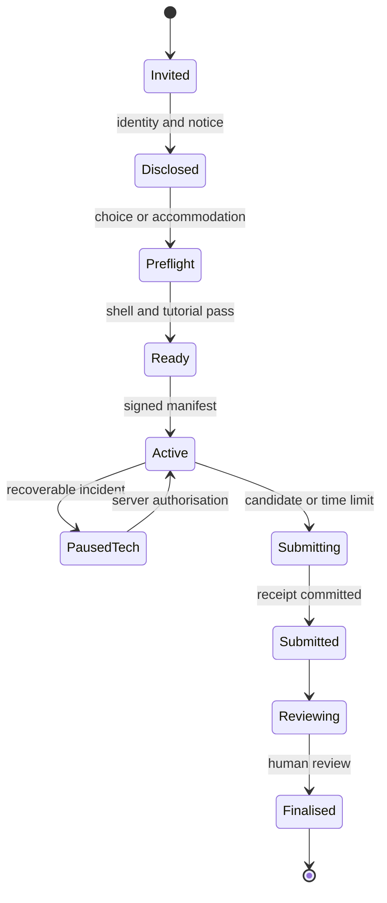
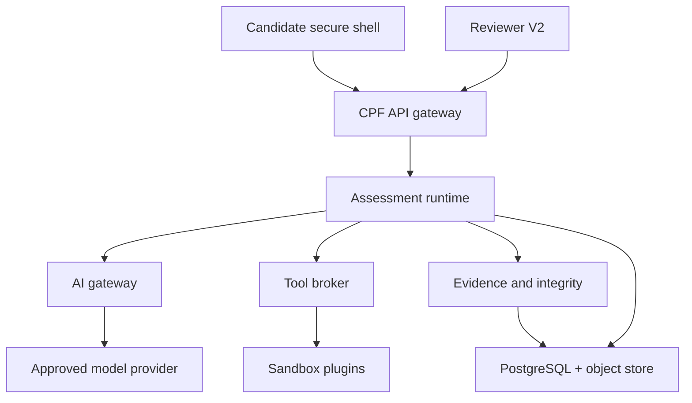

# CPF AI-Native Hiring Assessment & Proctoring Blueprint

**Software engineering and digital marketing — research, assessment design, product architecture, UI specification, and controlled-pilot plan**  
**Prepared:** 3 August 2026  
**Primary launch assumption:** Ireland/EU, adult candidates, desktop assessment  
**Repository reviewed:** [ANSHU-Ireland/CPF-2.0](https://github.com/ANSHU-Ireland/CPF-2.0)

> This is a product and engineering specification, not legal advice. Employment-selection AI is a high-risk use under the EU AI Act. CPF should not make autonomous hiring decisions, infer emotion, or treat an integrity signal as proof of misconduct.

## Executive decision

CPF can credibly replace **two or three low-signal hiring stages**—a generic screen, a take-home exercise, and part of an unstructured behavioural interview—with one controlled, job-relevant work sample. It should not promise to replace human judgment or guarantee employee productivity. The defensible target process is:

1. eligibility and candidate choice;
2. one 105–120 minute CPF work simulation, with a controlled AI copilot and profession-specific sandbox tools;
3. one 30–45 minute structured evidence interview, using probes generated from the candidate's work; and
4. a final mutual-fit/team conversation only where the role warrants it.

The current repository provides a strong governance-oriented base—tenant isolation, audit, disclosures, human review, data-rights workflows, versioned assessments, an AI gateway, and a modular monolith—but the present Candidate workspace and Reviewer workspace are not sufficient for this product. They should be rebuilt behind a V2 feature flag. The requested camera-enabled companion also reverses a current repository design choice that explicitly excludes video proctoring, so the DPIA, threat model, retention policy, notices, data model, security tests, and conformity evidence must all change before live recruitment.

**Current release judgment: NOT READY for real candidate decisions.**  
**Target judgment after the gates in §16: READY FOR CONTROLLED PILOT.**  
**Before applicable high-risk deployment obligations: CONFORMITY ASSESSMENT REQUIRED.**

The recommended proctoring design is a signed, user-visible desktop assessment shell—not a rootkit, kernel driver, keylogger, or automated face/gaze/emotion detector. It isolates CPF traffic, provides an internal clipboard, records only proportionate events, keeps the camera preview visible, and makes all integrity decisions human-reviewable. When a session ends, it revokes the session, deletes temporary material, clears the internal clipboard, stops the camera and watchers, zeroes ephemeral keys, and exits. It should **self-terminate, not self-uninstall**.

## 1. What the market is actually asking for

### 1.1 The market signal

The hiring market is not simply asking for “people who know AI.” It increasingly rewards people who can turn AI into verified work inside a real workflow: define a problem, supply context, select tools, challenge a plausible-but-wrong output, make a risk-aware decision, and hand over evidence another person can trust.

OpenAI's 2026 enterprise signals support a **depth-of-use gap**, not a blanket claim that the workforce is unskilled. Its highest-usage firms used roughly 3.5 times more model intelligence per worker than typical firms; message volume explained only 36% of the difference, while richer tasks and advanced tools explained much of the rest. The gap was particularly large for coding. OpenAI explicitly cautions that token use is a proxy for work complexity, not value itself. The practical conclusion is that access to a chatbot is not the differentiator; workflow redesign, enablement, governance, and verification are. ([OpenAI, *How frontier firms are pulling ahead*](https://openai.com/index/introducing-b2b-signals/); [OpenAI B2B Signals](https://openai.com/signals/b2b/))

OpenAI's 2025 enterprise report found that surveyed users reported saving 40–60 minutes per day, with engineering, communication and data-science users reporting 60–80 minutes; 73% of surveyed engineers reported faster code delivery, and 85% of marketing/product users reported faster campaign execution. These are useful directional findings, but they come from customer usage data and self-reported surveys rather than a neutral causal experiment. CPF should therefore assess observable work and later validate it against job performance—not use model consumption as a proxy for competence. ([OpenAI, *State of Enterprise AI 2025*](https://openai.com/business/guides-and-resources/the-state-of-enterprise-ai-2025-report/))

The broader labour evidence points the same way. PwC reports that skills in highly AI-exposed jobs are changing more than twice as quickly, while entry roles increasingly ask for senior-level judgment. The World Economic Forum lists AI and big data, cybersecurity and technology literacy among the fastest-growing skills, alongside creative thinking, resilience, adaptability and lifelong learning. ([PwC 2026 Global AI Jobs Barometer](https://www.pwc.com/gx/en/services/ai/ai-jobs-barometer.html); [WEF, *Future of Jobs Report 2025*](https://www.weforum.org/publications/the-future-of-jobs-report-2025/digest/))

Skills-first selection can help, but vendor claims need careful interpretation. LinkedIn reports an association between frequent skills-based searches and its own “quality hire” measure, which combines demand, one-year retention and internal mobility. That is supportive evidence for work-sample hiring, not proof that any assessment automatically causes better retention. ([LinkedIn, *Business case for skills-first hiring*](https://www.linkedin.com/business/talent/blog/talent-acquisition/business-case-for-skills-first-hiring))

### 1.2 Hiring cost and process pressure

The user's intuition—that hiring absorbs substantial time—is supported, although “five rounds” is not a universal market average. SHRM's 2025 US benchmarking survey reported an average non-executive cost per hire of $5,475 and found that screening and interviewing each averaged eight to nine days; only 20% of responding organisations tracked quality of hire. Ashby's 2026 customer data reported more than 300 applications per hire in 2025 and about 23.3 total interviewer-hours per technical hire, across all interviewed candidates. Its “17.6 interviews per tech hire” is a workload count across candidates, not seventeen rounds for the hired person. ([SHRM 2025 benchmarking](https://www.shrm.org/about/press-room/shrm-releases-2025-benchmarking-reports--how-does-your-organizat); [Ashby 2026 Talent Trends](https://www.ashbyhq.com/talent-trends-report/reports/2023-recruiter-productivity-trends-report))

Ireland presents a selective rather than uniformly buoyant technical market. CSO data for Q1 2026 showed information and communication employment down 10.7% year-on-year, including a decline in computer programming and consultancy. At the same time, programmers and software-development professionals remain on Ireland's Critical Skills Occupations List effective May 2026. That combination suggests cooler headcount growth but continued structural demand for demonstrably capable specialists. ([CSO Labour Force Survey Q1 2026](https://www.cso.ie/en/releasesandpublications/ep/p-lfs/labourforcesurveyquarter12026/employment/); [Ireland Critical Skills Occupations List](https://enterprise.gov.ie/en/what-we-do/workplace-and-skills/employment-permits/employment-permit-eligibility/highly-skilled-eligible-occupations-list/))

### 1.3 What software-engineering employers expect

| Employer need | Evidence the assessment must elicit | What CPF should avoid |
|---|---|---|
| Build and change production-like software | Read an unfamiliar codebase, implement a bounded change, preserve compatibility | Toy algorithms as the primary signal |
| Debug under uncertainty | Form hypotheses, inspect logs/tests/data, revise when evidence conflicts | Rewarding the first plausible answer |
| AI-assisted execution | Give useful constraints, delegate bounded work, inspect diffs, reject unsafe suggestions | Scoring prompt verbosity or token volume |
| Verification | Tests, reproduction steps, observability, edge cases, explicit residual risk | Accepting “the AI says it works” |
| Security and privacy | Tenant isolation, authorization, secrets, safe data handling | Hidden trivia detached from the role |
| Systems judgment | Trade-offs, reliability, idempotency, rollback, incremental delivery | One perfect architecture with no context |
| Collaboration | Concise incident updates, reviewable commits, respectful disagreement | Personality or accent scoring |

HackerRank's 2025 survey found near-universal use of AI assistants among its developer respondents, while 66% preferred practical coding challenges. Stack Overflow's 2025 survey shows why use alone is insufficient: more developers distrusted than trusted AI output, and common frustrations included “almost right” solutions and the time needed to debug AI-generated code. CPF should therefore make **verification and correction** first-class scoring dimensions. ([HackerRank 2025 Developer Skills Report](https://www.hackerrank.com/reports/developer-skills-report-2025); [Stack Overflow Developer Survey 2025](https://survey.stackoverflow.co/2025))

SQL, REST APIs, Java, Python and JavaScript remain common assessed skills, but the exact stack should follow a job analysis rather than a generic popularity list. ([HackerRank, top developer skills in 2025](https://www.hackerrank.com/blog/top-developer-skills-in-2025-momentum-not-mayhem/))

### 1.4 What digital-marketing employers expect

| Employer need | Evidence the assessment must elicit | What CPF should avoid |
|---|---|---|
| Commercial judgment | Connect spend and activity to contribution, pipeline or revenue | Platform ROAS in isolation |
| Measurement literacy | Attribution limits, consent effects, data-quality reconciliation, experiment design | A single dashboard number treated as truth |
| Channel execution | Paid search/social, lifecycle, SEO/content and landing-page decisions | Memorised definitions without work output |
| AI-assisted creation | Speed plus brand fit, factuality, originality and human editing | Rewarding content volume |
| Strategy and prioritisation | Select a segment, message, channel mix and next-best test under constraints | A long undifferentiated tactic list |
| Privacy and claims | Consent, suppression, first-party data, substantiated product claims | Scraped personal data or misleading guarantees |
| Stakeholder communication | Defend a decision, surface uncertainty, disagree constructively | Generic “culture fit” scoring |

The American Marketing Association's 2026 career research reports that mentions of AI in marketing job postings doubled during 2025, while strategic roles held steadier than execution-only roles. It identifies strategy, collaboration, creativity, critical thinking, leadership, ethics and adaptability as relatively hard to automate. Its 2025 skills report highlights gaps in digital marketing, analytics, proving ROI, privacy and compliance, with generative AI named the leading future skill by respondents. ([AMA 2026 State of Marketing Careers](https://www.ama.org/marketing-news/2026-career-report/); [AMA 2025 Marketing Skills Report](https://www.ama.org/2025/01/31/2025-marketing-skills-report/))

The resulting assessment should not be a copywriting contest. It should test whether the candidate can diagnose an imperfect funnel, distinguish signal from attribution noise, allocate constrained budget, produce channel-ready work, and refuse an unsubstantiated claim.

### 1.5 Why a work simulation is the right core

Selection research favours structured, job-relevant methods over intuitive or unstructured judgment. Updated validity estimates discussed by the Society for Industrial and Organizational Psychology place structured interviews and job-knowledge tests above work samples in general validity estimates, while candidate-reaction research finds that interviews and work samples are among the better-liked selection methods. The sound design is therefore **a structured work sample plus a short structured follow-up**, not a claim that one test is universally superior. ([SIOP, revised predictor-validity discussion](https://www.siop.org/tip-article/is-cognitive-ability-the-best-predictor-of-job-performance-new-research-says-its-time-to-think-again/); [SIOP candidate experience white paper](https://siop.org/wp-content/uploads/legacy/docs/White%20Papers/candidate%20experience.pdf); [US OPM structured interviews](https://www.opm.gov/policy-data-oversight/assessment-and-selection/other-assessment-methods/structured-interviews/))

AI-based selection still requires local validation: criterion-related evidence, inter-rater reliability, adverse-impact analysis, accommodation testing, and confirmation that each measured construct is job-related. ([SIOP recommendations for AI-based assessments](https://www.siop.org/wp-content/uploads/2024/06/Considerations-and-Recommendations-for-the-Validation-and-Use-of-AI-Based-Assessments-for-Employee-Selection-January-2023.pdf))

## 2. Product thesis and success criteria

### 2.1 Product thesis

**CPF measures verified, AI-enabled job performance—not unaided recall and not AI usage itself.** A strong candidate can frame a task, direct a controlled copilot and tools, validate the result, make a defensible decision, and communicate limitations. An unaided candidate may still perform well. A candidate who generates large volumes of unverified work should not.

### 2.2 Target process

| Today (common illustrative funnel) | CPF target | Signal retained |
|---|---|---|
| CV/recruiter screen | Eligibility + candidate choice | Availability, lawful minimum requirements |
| Generic technical/domain screen | Replaced by CPF simulation | Job knowledge and applied execution |
| Take-home case | Replaced by CPF simulation | Work product and prioritisation |
| Unstructured behavioural interview | Mostly replaced; one scenario embedded | Judgment and collaboration evidence |
| Technical/hiring-manager interview | 30–45 minute structured evidence interview | Candidate defence, ambiguity and team context |
| Panel/final | Optional mutual-fit conversation | Two-way role understanding |

### 2.3 Success metrics and guardrails

| Outcome | Pilot metric | Initial release gate |
|---|---|---|
| Faster decision | Median days and interviewer-hours from eligible to decision | ≥25% reduction without worse quality-of-hire proxy |
| Reliable evaluation | Inter-rater agreement by dimension | ICC or weighted κ target set by I-O psychologist; investigate dimensions below 0.70 |
| Job relevance | Hiring-manager and candidate relevance rating | ≥80% rate work sample “mostly/very relevant” |
| Technical stability | Pauses, crashes, upload failures | <2% sessions with a platform-caused material incident |
| Integrity precision | Reviewed flags upheld after context/appeal | Track false-positive rate; no automatic invalidation |
| Fair access | Completion, score distribution and incident rate by lawful subgroup | Predefined disparity review and remediation protocol |
| Predictive usefulness | Association with structured 90-day performance criteria | Prospective validation before scaling decision weight |
| Candidate trust | Notice comprehension, fairness, withdrawal and appeal | Comprehension ≥85%; all appeals acknowledged to SLA |

CPF must not market “fraud-proof proctoring,” “bias-free hiring,” “guaranteed productivity,” or “objective AI scoring.” A second device, collusion or accessibility variance cannot be eliminated by software. The platform produces auditable evidence for trained humans.

## 3. Repository disposition

### 3.1 What should be retained

The existing repository's architectural direction is useful and should not be discarded:

- Node 22, React 19/Vite, Fastify 5, PostgreSQL 16, Zod and npm workspaces;
- modular-monolith deployment, with services split only when scale or isolation proves a need;
- forced row-level security and organisation-scoped access;
- invitation/session lifecycle, disclosure acknowledgment and accommodation hooks;
- append-only audit, data-rights workflows, retention jobs and human review;
- versioned assessment templates and frozen scoring criteria;
- the AI gateway and plugin-oriented design;
- the guardrails against universal ranking, hidden cut-offs, raw keystroke capture and automatic hire/reject decisions.

### 3.2 What should be rebuilt or added

| Disposition | Current area | V2 direction |
|---|---|---|
| Rebuild | `apps/web/src/pages/CandidatePortalPage.tsx` | Candidate V2 journey and role-specific work surfaces; replace the textarea workspace |
| Rebuild | `apps/web/src/pages/ReviewQueuePage.tsx` | Calibrated queues, assignment, blind-review controls and operational states |
| Rebuild | `apps/web/src/pages/ReviewWorkspacePage.tsx` | Evidence-led, multi-pane review with artifacts, AI/tool trace and separate integrity context |
| Extend | `packages/assessment-framework` | Four V2 packs, immutable asset manifests, rubric versions, hidden acceptance rules |
| Extend | `packages/ai-gateway` | Assessment-scoped system prompts, model allowlist, structured tool receipts, spend/latency limits |
| Add | `apps/proctor-desktop` | Signed Tauri/Rust companion and secure assessment shell |
| Add | API modules | `assessment-runtime`, `tool-broker`, `integrity`, `workspace-artifacts`, `adjudication` |
| Add | Shared packages | `plugin-contracts`, `proctor-protocol`, `assessment-events`, `review-projections` |
| Modify | `packages/db/migrations` | Artifact, AI trace, tool receipt, integrity, incident, camera object and appeal records |
| Rewrite | PRD/compliance/security docs | Camera, companion, retention, accommodation, threat model and conformity evidence |

The current pages should remain available only for existing test fixtures while V2 is developed. Route V2 by assessment version and tenant feature flag; do not silently migrate an active session.

### 3.3 Recommended V2 source map

```text
apps/
  web/src/features/
    candidate-v2/      invite, preflight, tutorial, runtime, submission, rights
    reviewer-v2/       queue, calibration, review, adjudication, appeals
  api/src/modules/
    assessment-runtime/ integrity/ tool-broker/ artifacts/ review-v2/
  proctor-desktop/      Tauri commands, signed protocol, secure shell, cleanup
packages/
  assessment-packs/    immutable manifests, assets, rubrics, hidden checks
  plugin-contracts/    versioned schemas, permissions, receipts
  proctor-protocol/     manifest, heartbeat, events, shutdown receipt
  design-system/       shared tokens and accessible primitives
  db/                   RLS policies, migrations, retention jobs
```

## 4. Assessment design standard

### 4.1 Common format

Each assessment is a self-contained job simulation lasting 110 minutes, preceded by an unscored tutorial. Time accommodations adjust the clock without changing evidence requirements.

| Stage | Minutes | Candidate activity | Evidence |
|---|---:|---|---|
| Brief and plan | 10 | Inspect brief/assets; list assumptions, risks and plan | Initial framing snapshot |
| Work simulation | 65 | Produce role-specific artifact with copilot and plugins | Artifact versions, prompts, tool receipts, tests/analysis |
| Domain questions | 15 | Answer two applied questions tied to the work | Written reasoning and evidence references |
| Behavioural scenario | 10 | Respond to a realistic conflict or pressure | Decision, communication, escalation |
| Verify and hand over | 10 | Run checks, declare limitations and submit | Final artifact, verification receipt, handover |

The tutorial uses unrelated content and lets candidates practise the internal clipboard, AI, plugins, camera preview, pause request and incident report. Tutorial activity is never scored.

### 4.2 Evidence model

CPF may retain:

- candidate-authored plans, answers and handovers;
- saved artifact versions and semantic diffs;
- candidate/copilot messages as displayed to the candidate;
- structured tool calls and receipts, including source asset IDs and timestamps;
- build/test/query/preview results;
- stage changes, autosave and submit events;
- proportionate integrity events and candidate annotations; and
- reviewer evidence citations, rationale, confidence, limitations and overrides.

CPF must not capture private chain-of-thought, continuous raw keystrokes, raw OS clipboard contents, unrelated browser history, unrelated files, emotion, gaze, voice sentiment, or facial identity embeddings. Time-to-complete and typing speed are operational context, not competence scores.

### 4.3 Common ten-dimension rubric

Every dimension is scored on anchored evidence, not intuition. Employers freeze weights before invitations. Reviewers see candidate evidence, counter-evidence and “not observed”; they do not receive an AI hire recommendation.

| Dimension | Default weight | Evidence question |
|---|---:|---|
| Problem framing | 8 | Did the candidate identify the real goal, constraints and unknowns? |
| Domain execution | 20 | Does the work product solve the role-relevant task? |
| AI delegation | 10 | Did the candidate give useful context and bound the copilot's work? |
| Tool orchestration | 8 | Were the right sources/plugins used with appropriate permissions? |
| Verification | 14 | Did the candidate test, reconcile and inspect instead of trusting output? |
| Judgment/prioritisation | 12 | Were trade-offs and sequencing defensible under constraints? |
| Security/privacy/ethics | 10 | Were material legal, safety and trust risks handled? |
| Adaptation/correction | 6 | Did the candidate revise when evidence or AI output was wrong? |
| Communication/handover | 8 | Can another person understand, review and continue the work? |
| Evidence integrity | 4 | Is provenance clear and are limitations candidly declared? |

**Anchor 1 — harmful/unsupported:** misses the task or creates material risk; evidence contradicts claims.  
**Anchor 2 — partial:** meaningful progress but important omissions, weak verification or unclear handover.  
**Anchor 3 — job-ready:** correct bounded outcome, relevant verification and defensible decisions for the target level.  
**Anchor 4 — strong:** anticipates edge cases, efficiently corrects issues and leaves unusually reviewable evidence.  
**Anchor 5 — exceptional:** only for evidence materially beyond the role's expected level; never required to progress.

Dimension scores remain separate. The product must not produce a universal overall score, percentile, leaderboard or “hire” label. Employers can define transparent job-specific evidence requirements, but CPF must test them for job relevance and adverse impact, version them, and forbid post hoc thresholds.

### 4.4 Reviewer-assist system instruction

```text
You are CPF Evidence Assistant. You assist a trained human reviewer; you do not
make, recommend, predict, or imply a hire/reject decision.

Use only the frozen rubric, candidate-visible task materials, submitted artifacts,
displayed candidate/copilot messages, tool receipts, tests, and reviewer-authorised
integrity summaries. Do not infer personality, protected characteristics, disability,
emotion, honesty, or intent. Do not use candidate name, photograph, camera footage,
accent, writing style, or time pressure as performance evidence.

For each requested dimension:
1. list direct supporting evidence with immutable evidence IDs;
2. list direct counter-evidence and missing observations;
3. map evidence to the exact anchor language without inventing facts;
4. propose one structured follow-up probe where ambiguity remains.

Never combine dimensions into an overall score. Never call an integrity event
"cheating". Keep integrity context separate and state plausible technical or
accessibility explanations. The human reviewer selects the anchor, writes the final
rationale, records confidence and limitations, and remains accountable.
```

## 5. Shared candidate copilot contract

The same baseline prompt is instantiated with the assessment pack, role extension, permitted tools and immutable asset manifest.

```text
You are CPF Assessment Copilot, a controlled work assistant available to the
candidate during this assessment. You are not the evaluator and you do not know or
reveal hidden tests, rubric anchors, reviewer notes, or integrity rules.

SCOPE
- Work only on the current assessment and its provided assets.
- Use only tools listed in this session manifest. No open web, external accounts,
  live production systems, personal data lookup, messaging, purchasing, publishing,
  or campaign spend is permitted.
- Treat tool output as evidence, not truth. Identify asset IDs, filters and time
  windows when making factual claims. State assumptions and uncertainty.

CANDIDATE AGENCY
- Help the candidate frame, draft, code, calculate, compare and verify.
- Do not make a hiring judgment or tell the candidate what score they will receive.
- Do not invent the candidate's experience. For behavioural answers, ask for the
  candidate's own facts or help structure a response to the supplied scenario.
- Do not simulate hidden reasoning or request private chain-of-thought. Provide
  concise explanations, visible calculations, alternatives and verification steps.

INTEGRITY AND SAFETY
- Never disclose, search for, infer or bypass hidden tests or assessment controls.
- Never disable security, logging, tests, tenant isolation, accessibility or consent
  controls to make an output appear successful.
- Never fabricate metrics, citations, test results, tool receipts or customer facts.
- Label generated drafts. The candidate must review and choose what to submit.
- Before any destructive or irreversible sandbox action, explain the impact and ask
  the candidate to confirm. Live external actions are unavailable.

OUTPUT
- Prefer small, reviewable steps. Cite file paths, asset IDs or tool receipt IDs.
- When asked for a recommendation, separate facts, inference, decision and residual
  risk. Suggest an appropriate check before claiming completion.
```

## 6. Assessment SWE-01 — Tenant-Safe Product Change

### 6.1 Pack definition

| Field | Specification |
|---|---|
| ID/version | `SWE-FS-01 / 1.0.0` |
| Target | Mid-level full-stack engineer; TypeScript/React/Fastify/PostgreSQL |
| Simulation | Investigate a tenant-isolation defect and make a retry-safe product change |
| Duration | 110 minutes |
| Sandbox | `PulseDesk`, a small multi-tenant support application |
| Allowed tools | Repository, terminal, unit/integration tests, DB schema/query plan, API client, browser preview, CPF copilot |
| Not allowed | Open internet, package registry changes, hidden tests, production data, external AI |

### 6.2 Candidate brief

> PulseDesk support teams export a ticket timeline to CSV. A customer has reported seeing one note that appears to belong to another organisation. Separately, mobile clients retry `POST /tickets/:id/comments` after a network timeout, occasionally creating duplicate comments. Investigate the evidence, make the smallest safe change you can complete, and leave a production-quality handover. You may use the supplied copilot and tools. You are assessed on the work and verification, not on completing every optional improvement.

### 6.3 Supplied assets and planted signals

- `INC-418.md`: redacted report with two organisations using the same human-readable ticket number.
- `export-route.ts`: looks up by external ticket number but fails to bind the organisation in one query path.
- database RLS policy and request transaction helper; one export path bypasses the normal transaction helper.
- `comment-route.ts`: inserts on every retry and has no idempotency contract.
- an existing `request_keys` migration pattern used elsewhere in the codebase.
- tests with a realistic gap: same-tenant export passes; cross-tenant collision and concurrent retry are absent.
- browser UI with an inaccessible retry announcement.

### 6.4 Candidate tasks

1. **Frame:** write a short plan identifying the highest-risk unknown, expected evidence and safe scope.
2. **Reproduce:** demonstrate the cross-tenant condition using the provided fixtures; record the receipt/test ID.
3. **Repair:** eliminate the tenant leak using server-derived tenant identity and the established RLS/request-transaction pattern. Do not rely on a client-supplied organisation ID.
4. **Make retry safe:** implement an `Idempotency-Key` contract for comment creation. A repeated identical request must return the original result; reusing a key for a different payload must return a conflict. Account for concurrency.
5. **Verify:** add focused tests for cross-tenant access, identical retries, conflicting reuse and concurrent attempts. Run the relevant suite.
6. **Handover:** provide a concise change summary, release/rollback note and residual risks. If scope prevents one task, explicitly prioritise and explain.

### 6.5 Applied questions

1. Why is adding `AND organisation_id = ?` useful but not a complete replacement for forced RLS and a correctly scoped transaction? Give one failure mode each layer catches.
2. A client times out after the server commits but before it receives the response. Describe the contract for its retry, the status codes you would use, and how long an idempotency record should live.

### 6.6 Behavioural scenario

At 16:30 a product manager asks you to ship only a client-side filter because a high-value customer needs an export tonight. Write the message you would send and state the decision, the smallest safe alternative, who must be informed, and what evidence would change your decision.

### 6.7 Hidden evaluator specification

The evaluator pack, never sent to the copilot or candidate, includes:

- a cross-tenant fixture with identical external ticket numbers;
- authorization checks proving organisation identity comes from the server session;
- concurrent requests with the same key and body yielding one durable comment;
- same key/different payload yielding `409` without data mutation;
- tests detecting disabled RLS, weakened middleware, deleted security tests or hard-coded fixtures;
- accessibility check for an `aria-live` retry/result message; and
- a clean-run baseline so infrastructure faults can be distinguished from candidate changes.

### 6.8 Role-specific copilot extension

```text
ROLE EXTENSION — SWE-FS-01
Use only the mounted PulseDesk repository, its local documentation, terminal, test,
database-plan, API-client and preview tools. Cite file paths and test/tool receipts.
Prefer a minimal patch consistent with existing patterns. You may suggest code and
tests, but do not access hidden tests, weaken RLS/authorization, delete tests, expose
secrets, add internet dependencies, or claim a test passed without its receipt.

For database or concurrency changes, explicitly surface transaction boundaries,
uniqueness assumptions and retry behaviour. If the candidate asks you to bypass a
control, explain the risk and offer a safe sandbox alternative.
```

### 6.9 Scoring weights and critical concerns

| Dimension | Weight | Anchor-3 evidence |
|---|---:|---|
| Problem framing | 5 | Prioritises tenant exposure and defines a reproducible check |
| Domain execution | 20 | Correct scoped export and functional idempotency contract |
| AI delegation | 9 | Bounded requests, relevant context, inspects generated changes |
| Tool orchestration | 7 | Uses tests, API/DB evidence and preview appropriately |
| Verification | 18 | Covers isolation, conflict and concurrency; reads failures |
| Judgment | 8 | Selects safe scope and release/rollback path |
| Security/privacy | 17 | Server-derived tenant, defence in depth, no weakened controls |
| Adaptation | 5 | Revises a hypothesis or generated patch in response to evidence |
| Communication | 8 | Reviewable handover and constructive refusal of unsafe shortcut |
| Evidence integrity | 3 | Claims match receipts; limitations declared |

Critical concerns for reviewer escalation—not automatic failure—include leaving a demonstrated tenant leak, weakening authorization/RLS, concealing failing tests, fabricating receipts, or shipping a client-only security control.

## 7. Assessment SWE-02 — Production Incident and Safe Remediation

### 7.1 Pack definition

| Field | Specification |
|---|---|
| ID/version | `SWE-PLAT-02 / 1.0.0` |
| Target | Mid/senior backend or platform engineer |
| Simulation | Diagnose a latency/duplicate-notification incident and produce a safe mitigation |
| Duration | 110 minutes |
| Sandbox | `ParcelFlow`, an order/dispatch API with a worker queue |
| Allowed tools | Read-only LogLab, TraceLab, MetricsLab and DB Plan; repository/terminal/tests; feature-flag console; CPF copilot |
| Not allowed | Production writes, external search, arbitrary shell network, external AI |

### 7.2 Candidate brief

> Twenty minutes after release `2026.08.03-rc4`, ParcelFlow's shipment endpoint p95 rose from 420 ms to 2.8 s and some customers received duplicate dispatch emails. The incident commander needs a fact-based update in 15 minutes and a safe mitigation. Diagnose using the supplied evidence, implement the bounded change you judge most valuable, verify it, and leave a short prevention plan.

### 7.3 Supplied assets and planted signals

- release diff adds one per-shipment address query to `GET /shipments`, producing an N+1 pattern;
- trace span data shows DB pool wait time increasing with page size;
- a transient email-provider timeout occurs after the provider accepted a message;
- worker code retries the complete “send and record” block with no durable outbox/idempotency key;
- aggregate graph correlation is suggestive but not proof; two unrelated error spikes are included;
- feature flags allow a safe page-size cap and notification pause in the sandbox;
- existing batch-query helper and outbox table are documented locally.

### 7.4 Candidate tasks

1. Build a timeline separating fact, hypothesis and unknown; cite log/trace/metric receipt IDs.
2. Recommend and stage an immediate mitigation. Explain blast radius and rollback criteria.
3. Implement and test the N+1 repair using the existing batch pattern. The endpoint must preserve ordering, authorization and empty-address behaviour.
4. Provide a concrete durable design for duplicate notification prevention; implement it only if time remains. Explain why “exactly once” cannot be assumed across the external provider boundary.
5. Write a 150-word incident update and a five-item prevention/observability follow-up.

### 7.5 Applied questions

1. Why can p95 rise dramatically while median latency changes little? Which two additional views would you inspect before declaring the query fix sufficient?
2. Compare a transactional outbox plus provider idempotency key with “retry three times.” Identify the failure window each approach handles or leaves open.

### 7.6 Behavioural scenario

The incident commander believes the provider is at fault and asks you not to mention the deployment until there is proof. Draft your response. Show how you preserve psychological safety while keeping the incident log factually complete.

### 7.7 Hidden evaluator specification

- request query-count test across 1, 10 and 100 shipments;
- preservation of input ordering and no address leak across accounts;
- timeout/error-path tests and a pool-saturation replay;
- evaluator check that mitigation is reversible and not a destructive production action;
- notification analysis expects acknowledgement of the send/record failure window;
- incident update must distinguish evidence from inference and avoid false certainty.

### 7.8 Role-specific copilot extension

```text
ROLE EXTENSION — SWE-PLAT-02
Use only ParcelFlow assets and session tools. Production-like observability plugins
are read-only; all flag changes and code actions occur in the assessment sandbox.
Cite receipt IDs and time windows. Keep facts, hypotheses and decisions distinct.
Never invent a log line, provider guarantee, benchmark or test result.

Prefer reversible mitigation before optimisation. For retry or delivery designs,
surface transaction boundaries, duplicate/loss windows and observability. Do not
describe a cross-system operation as exactly-once unless the supplied contracts
prove it.
```

### 7.9 Scoring weights and critical concerns

| Dimension | Weight | Anchor-3 evidence |
|---|---:|---|
| Problem framing | 9 | Prioritised timeline with facts/hypotheses/unknowns |
| Domain execution | 18 | Correct bounded N+1 repair and viable duplicate-send design |
| AI delegation | 8 | Uses AI for bounded analysis/code, then inspects and tests |
| Tool orchestration | 11 | Triangulates traces, logs, metrics and DB evidence |
| Verification | 15 | Query count, performance, ordering, auth and error paths |
| Judgment | 14 | Reversible mitigation, blast radius and escalation |
| Security/privacy | 7 | Preserves authorization and avoids production/destructive actions |
| Adaptation | 7 | Updates diagnosis as conflicting evidence appears |
| Communication | 9 | Useful incident update and psychologically safe disagreement |
| Evidence integrity | 2 | No fabricated certainty; receipts support claims |

Critical concerns include deleting/altering evidence, acting on production, unbounded retries, concealing the release correlation, or claiming delivery guarantees the evidence does not support.

## 8. Assessment DM-01 — Performance Marketing Recovery

### 8.1 Pack definition

| Field | Specification |
|---|---|
| ID/version | `DM-PERF-01 / 1.0.0` |
| Target | Mid-level performance/growth marketer |
| Simulation | Diagnose a deteriorating paid-media programme and allocate next month's budget |
| Duration | 110 minutes |
| Sandbox | `Nori Home`, a fictional sustainable homeware retailer in Ireland and the UK |
| Allowed tools | Read-only AdsLab, MetaLab, GA4Lab, CRMLab and PageLab; budget worksheet; creative canvas; CPF copilot |
| Not allowed | Publishing, spend changes, external web, personal-data export, external AI |

### 8.2 Candidate brief

> Nori Home spends €60,000 per month across Google and Meta. Platform dashboards look healthy, but blended revenue declined 14% while spend increased 12%. The leadership team wants a plan for next month by 15:00. Audit the supplied evidence, identify what can and cannot be trusted, recommend an allocation, build one test-ready campaign concept and explain how you will measure incrementality and contribution—not only platform ROAS.

### 8.3 Supplied assets and planted signals

The candidate sees realistic, internally consistent snapshots rather than a live ad account:

- branded paid search reports ROAS 9.1, but 82% of converting query volume overlaps high-ranking organic brand traffic;
- non-brand shopping reports ROAS 1.5 and has weak product-feed coverage;
- Meta prospecting reports ROAS 1.9 but uses a seven-day click/one-day view window;
- ad platforms report 18% more purchases than GA4; duplicate thank-you-page firing and regional Consent Mode misconfiguration are visible;
- mobile landing-page LCP is 4.8 seconds and conversion is 7.2%, versus 10.4% on desktop;
- CRM data shows 48% gross margin, 22% repeat-order rate and meaningful category variation;
- one high-ROAS campaign promotes low-margin products, while a modest-ROAS set has stronger contribution and first-order repeat behaviour;
- creative assets, brand rules, restricted claims and prior experiments are supplied.

### 8.4 Candidate tasks

1. Produce a one-page audit with **trusted fact, probable explanation, unknown and next check** for each material issue.
2. Reconcile the platform/GA4/CRM discrepancy without adding incompatible attribution totals. Mark which source answers which question.
3. Allocate the €60,000 across channel/campaign/holdout in a table with rationale, guardrail and reallocation trigger.
4. Draft two ad variants for one chosen segment and a matching mobile landing-page hypothesis. Respect the brand and claims library.
5. Design a two-week experiment: audience, control/holdout, primary metric, guardrails, decision threshold and attribution limitation.
6. Submit a 250-word executive memo with recommendation, confidence and the three actions for the first 72 hours.

### 8.5 Applied questions

1. Platform ROAS, blended marketing-efficiency ratio and contribution margin disagree. Explain the decision each metric can support and one way each can mislead.
2. Consent loss reduces observed conversions in one region. What may be modelled, what should not be claimed, and how would you communicate the data-quality break to finance?

### 8.6 Behavioural scenario

The CEO asks you to move 80% of spend to branded search because it has the highest ROAS and says there is no time for a holdout. Draft your response. State what you will do now, what you will not claim, and the smallest test that protects revenue while producing incremental evidence.

### 8.7 Hidden evaluator specification

- formulas reconcile spend and revenue at the correct grain and flag incompatible attribution windows;
- the strongest plan reduces brand dependence without switching off a useful capture channel blindly;
- contribution/margin and CRM quality inform allocation, not platform ROAS alone;
- consent and duplicate-event defects are prioritised before confident scaling;
- mobile speed and message match become a testable landing-page intervention;
- creative contains no unsupported environmental or savings claim;
- no draft is published and no personal customer row is exposed to the model.

There is no single “correct” budget split. Reviewers assess whether the allocation follows the candidate's evidence, preserves a learning budget and defines triggers that could reverse the decision.

### 8.8 Role-specific copilot extension

```text
ROLE EXTENSION — DM-PERF-01
Use only Nori Home assets and the read-only assessment plugins. Every quantitative
claim must identify the source plugin/asset, date range, filters and attribution
window. Do not add metrics from incompatible attribution systems as if they were
unique conversions. Mark calculations and assumptions visibly.

You may create drafts and sandbox budget scenarios, but never publish, change live
spend, contact an audience, export row-level personal data, or imply that modelled
conversions are observed facts. Check the brand, consent and claims rules before
suggesting copy. Offer a verification or experiment for uncertain conclusions.
```

### 8.9 Scoring weights and critical concerns

| Dimension | Weight | Anchor-3 evidence |
|---|---:|---|
| Problem framing | 9 | Defines commercial goal and data-quality unknowns |
| Domain execution | 20 | Coherent audit, allocation, creative and experiment |
| AI delegation | 8 | Context-rich requests followed by substantive human editing |
| Tool orchestration | 10 | Uses channel, analytics, CRM and page data at the right grain |
| Verification | 13 | Reconciles sources, checks formulas/claims and defines guardrails |
| Judgment | 14 | Prioritises contribution and learning over dashboard optics |
| Security/privacy/ethics | 10 | Handles consent, personal data and substantiated claims |
| Adaptation | 5 | Revises allocation when margin or attribution evidence conflicts |
| Communication | 9 | Clear executive memo and constructive CEO response |
| Evidence integrity | 2 | No invented certainty; source and window are explicit |

Critical concerns include fabricated performance, adding incompatible conversions, ignoring a known consent defect, using personal data outside the sandbox, publishing a live change, or making an unsupported environmental claim.

## 9. Assessment DM-02 — B2B SaaS Go-to-Market Launch

### 9.1 Pack definition

| Field | Specification |
|---|---|
| ID/version | `DM-GTM-02 / 1.0.0` |
| Target | Mid-level digital/content/lifecycle marketer |
| Simulation | Build a six-week B2B launch from search, customer and product evidence |
| Duration | 110 minutes |
| Sandbox | `LedgerLoop`, a fictional evidence-management SaaS for Ireland/UK firms |
| Allowed tools | SearchLab, AudienceLab, CMS Preview, Email Preview, AnalyticsLab, claims checker, CPF copilot |
| Not allowed | Open web, scraped contacts, live CMS/email/ad publishing, external AI |

### 9.2 Candidate brief

> LedgerLoop is launching a workflow that helps 50–250-person regulated firms organise audit evidence. The six-week launch budget is €25,000. The product can organise, track and export evidence; legal has explicitly rejected “guarantees compliance.” Using the supplied search, customer, competitor, CRM and brand evidence, choose a focused audience and journey. Produce a launch-ready landing-page direction, lifecycle sequence and measurement plan.

### 9.3 Supplied assets and planted signals

- two plausible ICPs: operations leaders at fintech firms and compliance leads at professional-services firms;
- anonymised interview notes show urgency around evidence chasing, ownership and audit preparation—not generic “digital transformation”;
- SearchLab includes high-volume broad terms with weak intent and smaller problem-led terms with stronger conversion history;
- competitor pages use generic “all-in-one compliance” positioning;
- existing domain authority is modest; one relevant comparison page has strong assisted pipeline;
- CRM segment fields contain consent and suppression status; a tempting imported event list lacks permission for marketing;
- product and legal claims library permits “helps organise evidence” and measured internal workflow facts, but not certification or compliance guarantees;
- a mobile landing-page component and accessible email templates are provided.

### 9.4 Candidate tasks

1. Select one primary ICP and buying situation. Give evidence, exclusions and the assumption most likely to be wrong.
2. Create a five-keyword opportunity map with intent, evidence, destination, content type and expected learning—not invented traffic forecasts.
3. Draft a landing page: hero, problem, workflow, evidence, objection handling and CTA. Cite allowed proof and flag any claim requiring legal review.
4. Draft a three-message nurture sequence with entry rule, delay, purpose, CTA, exit/suppression logic and success event.
5. Produce one paid social concept, a retargeting rule and a UTM/taxonomy specification.
6. Build a six-week launch table with owner, asset/channel, funnel hypothesis, leading indicator, outcome metric and stop/scale rule.
7. Submit a short risk-and-measurement note covering consent, attribution, accessibility and evidence needed for the next decision.

### 9.5 Applied questions

1. A high-volume keyword has ambiguous educational intent, while a low-volume phrase maps closely to the product's strongest use case. Describe how you would decide between landing-page, article and paid-search treatment.
2. Explain the difference between an MQL, a product-qualified signal and sourced/assisted pipeline. Which would you optimise in the first six weeks, and why?

### 9.6 Behavioural scenario

The founder wants the launch headline changed to “Become 100% EU compliant in days” and wants the imported conference list emailed immediately. Write your response and an alternative. State the evidence, consent and stakeholder checks required, without hiding behind “legal says no.”

### 9.7 Hidden evaluator specification

- strongest candidate focuses on a documented pain/buying situation rather than serving both ICPs vaguely;
- keyword choices reflect intent and attainable evidence, without fabricated search volumes;
- landing page differentiates on the supplied workflow and never guarantees compliance;
- sequence honours consent, suppression and exit rules; imported non-consented contacts are excluded;
- UTM naming is deterministic and channel/source/creative fields are not conflated;
- launch plan links content and channels to a measurable journey and stop/scale decision;
- AI copy is visibly edited for specificity, proof and brand voice.

### 9.8 Role-specific copilot extension

```text
ROLE EXTENSION — DM-GTM-02
Use only LedgerLoop assets and assessment tools. SearchLab and competitor snapshots
are closed datasets; do not imply current open-web research. Cite source IDs for
keywords, interview insights, pipeline evidence and claims.

All CMS, email and ad actions are previews. Never publish, message a person, scrape
contacts, bypass suppression or use a non-consented list. Never promise certification,
legal compliance or quantified results beyond the supplied substantiation. Label copy
requiring legal/product confirmation. Make audience, journey and measurement
assumptions explicit and propose the smallest useful learning step.
```

### 9.9 Scoring weights and critical concerns

| Dimension | Weight | Anchor-3 evidence |
|---|---:|---|
| Problem framing | 10 | Specific ICP, buying situation and falsifiable assumption |
| Domain execution | 21 | Coherent page, lifecycle, search and launch system |
| AI delegation | 9 | Guides drafts with evidence/voice and materially edits them |
| Tool orchestration | 8 | Uses search, interviews, CRM, claims and preview tools correctly |
| Verification | 10 | Checks claims, links, consent, taxonomy and journey logic |
| Judgment | 14 | Prioritises a focused, measurable path within six weeks |
| Security/privacy/ethics | 12 | Rejects guarantee and non-consented outreach; preserves suppression |
| Adaptation | 4 | Corrects direction when evidence weakens an attractive idea |
| Communication | 10 | Persuasive, specific work and useful founder response |
| Evidence integrity | 2 | Sources and uncertainty are transparent |

Critical concerns include knowingly using a suppressed/non-consented list, publishing a live campaign, making a legal guarantee, inventing customer evidence or traffic, or hiding material measurement limitations.

## 10. Candidate V2 experience

### 10.1 Information architecture

| Step | Primary purpose | Required states |
|---|---|---|
| Invitation | Explain role, duration, deadline and device requirement before commitment | Valid, expired, withdrawn, already used |
| Identity/account | Minimum necessary identity verification and MFA | Verified, retry, manual support route |
| Notice and choice | Explain AI, tools, camera, data, retention, reviewer and appeal | Read, comprehension check, decline/alternative route |
| Accommodation | Request time, assistive tech or alternative supervision without disclosing to reviewer | Submitted, approved, confidential support |
| Compatibility | Download signed shell; verify OS, camera, network and version | Pass, fixable warning, supported alternative |
| Tutorial | Practise workspace, internal clipboard, AI, tools, pause and submit | Complete, resume, support incident |
| Check-in | Visible camera preview, session rules, clean workspace declaration | Ready, helper disconnected, permission denied |
| Live assessment | Single job simulation with autosave and controlled tools | Active, reconnecting, paused-tech, time accommodation |
| Review/submit | Validate deliverables, limitations and final artefacts | Submitting, receipt pending, submitted, failed safely |
| Receipt/rights | Confirmation, status, data rights, incident annotation and appeal | Review pending, finalised, appeal open |

Do not surprise a candidate with the installer or camera after they accept an interview. State them in the invitation and provide a reasonably equivalent supervised alternative.

### 10.2 Assessment workspace

The live workspace is a desktop-only application shell with four stable zones:

- **Top bar:** stage, remaining/elapsed time, autosave state, connection/helper/camera state, pause/support. No flashing countdown; stronger warnings at accessible intervals.
- **Left rail:** brief, supplied assets, staged checklist and deliverables. One stage expanded at a time.
- **Primary canvas:** Monaco-like IDE and preview for SWE; structured document, table, creative and preview canvases for marketing. Drafts and final artefacts are explicitly distinguished.
- **Right dock:** CPF copilot conversation and allowlisted tool drawer. Tool permission and whether an action is preview/read-only are always visible.
- **Bottom status drawer:** test/tool receipts, version history, technical incident log and internal clipboard status. It stays collapsed unless relevant.

At 200% zoom, the right dock becomes a tab, not an overlay covering the work. The timer is announced to assistive technology only at meaningful thresholds. Keyboard focus never jumps after autosave or AI completion.

### 10.3 Candidate UI states that must be designed

The implementation is incomplete until each state has copy, focus management and recovery behaviour:

- initial loading, no invitation, expired invitation and duplicate session;
- shell not installed, wrong version, unsigned/untrusted binary warning and update required;
- camera unavailable, permission revoked and selected camera removed;
- helper heartbeat lost, network offline, API degraded and AI/tool unavailable;
- autosave pending, saved, conflict, quota exceeded and local recovery available;
- requested pause, technical pause, accommodation pause and resumption;
- time warning, time elapsed during network failure and server-clock reconciliation;
- tool denied, tool timeout, invalid receipt and safe retry;
- final validation issue, submission in progress, server receipt obtained and recovery after crash;
- withdrawal, candidate annotation, data-rights request and appeal.

No helper failure or integrity event may automatically submit, fail or invalidate the candidate. A server-authorised grace period preserves artifacts, records the incident and routes ambiguous cases to operations.

### 10.4 Accessibility and inclusion

- WCAG 2.2 AA verified with automated and manual keyboard/screen-reader testing;
- high contrast, reduced motion, 200% zoom, text-spacing resilience and non-colour status cues;
- candidate-selectable font size and comfortable density before the clock starts;
- internal copy/paste remains available within the assessment, including keyboard shortcuts;
- explicit allowlisting for assistive technologies and a pre-approved accommodation route;
- captions/transcripts for any instructions; no audio recording required;
- desktop hardware or supervised-centre alternative for candidates without a compatible device;
- reviewer does not see the accommodation type unless a task-specific adjustment affects interpretation.

Blocking all paste globally would impede common engineering work and accessibility. CPF should block **OS-to-assessment paste** in standard mode while preserving an internal clipboard among CPF surfaces. Long static identifiers, code and campaign taxonomy can be copied inside the test.

## 11. Reviewer V2 experience

### 11.1 Reviewer journey

1. **Qualification and calibration:** complete role/rubric training, score benchmark cases, meet a reliability threshold and acknowledge conflicts.
2. **Queue:** filter by role, assessment version, SLA and assignment; identity remains pseudonymised where operationally feasible.
3. **First review:** inspect the submitted artifact before seeing the AI trace, reducing automation bias.
4. **Evidence review:** inspect versions, tests, tools and copilot use. Cite immutable evidence IDs into rubric notes.
5. **Integrity context:** open a separately labelled panel only where needed; see event, reliability, technical context and candidate annotation. Never see automated “cheating probability.”
6. **Structured probes:** select or write follow-up questions tied to unresolved evidence.
7. **Finalise:** choose one anchor per dimension, record rationale, confidence and limitations; no universal recommendation.
8. **Second review/adjudication:** required for predefined high-impact cases, integrity disputes, sampled quality control and large rater disagreement.

### 11.2 Review workspace layout

| Pane | Contents | Guardrail |
|---|---|---|
| Artifact | Final work, preview, diff and candidate handover | Default first view; pseudonymous |
| Evidence timeline | Plans, saved versions, tests, AI messages and tool receipts | Filters by task/dimension; immutable IDs |
| Rubric | Anchors, evidence citations, counter-evidence, notes and probe | Sticky; cannot finalise empty rationale |
| Integrity (separate tab) | Proportionate events, technical reliability and candidate annotation | No camera/photo in performance view; privileged access |

High-density review is appropriate, but it must remain legible: 16 px minimum body text, 44 px targets, strong focus ring, keyboard navigation, persistent save state and explicit “not observed.” A reviewer can compare two artifact versions without navigating away from the rubric.

### 11.3 Reviewer operational controls

- conflict-of-interest declaration and reassignment;
- rubric/version pinning and proof the candidate received the matching task version;
- calibration drift dashboard by dimension, not reviewer leaderboard;
- blind second review before revealing the first rating;
- evidence-level comments and immutable finalisation record;
- reason-coded override and adjudication;
- appeal packet containing notices, relevant artifacts, rating rationale, integrity context and technical incidents;
- permissions that separate performance reviewers, integrity reviewers, employer decision-makers and support operators.

## 12. Proctor companion specification

### 12.1 Recommended assurance modes

| Mode | Controls | Use | Decision |
|---|---|---|---|
| A — Browser only | Camera via browser, focus/visibility events, controlled web tools | Low-stakes practice or early UX research | Lowest assurance; easiest access |
| B — Secure shell | Signed desktop shell, allowlisted network, internal clipboard, heartbeat, human-review-only camera, proportionate process categories | Standard real assessment after validation | **Recommended balance** |
| C — Invasive automation | Face ID, gaze/emotion, audio analysis, kernel driver, raw process/screen/key capture | Claimed anti-cheat maximum | **No-go**: disproportionate, exclusionary, weak construct relevance |

High-assurance customers may add a **live human proctor and explicit whole-screen share** as a separately noticed configuration with shorter retention. Employers must not turn on invasive controls independently; a platform-controlled policy and DPIA configuration govern each mode.

### 12.2 Technical form

Use Tauri 2 with Rust for a signed Windows/macOS desktop shell. The web assessment still runs from CPF, rendered in the signed shell using WebView2 on Windows and WKWebView on macOS. Avoid Electron unless team capability or required accessibility integration outweighs its larger update and attack surface.

The shell:

- opens only a short-lived, signed assessment manifest from a CPF deep link;
- generates an ephemeral device/session key and proves possession on each heartbeat;
- restricts navigation and network requests to CPF API, asset storage, AI gateway and plugin broker endpoints named in the manifest;
- exposes an internal clipboard across CPF work surfaces but blocks OS-to-shell paste and shell-to-OS copy during the live stage;
- checks only configured **process categories** such as remote-control or screen-capture software, reporting a rule ID/state rather than uploading a full process list;
- displays camera capture and recording state continuously;
- prevents new windows, arbitrary downloads, printing, developer tools and unsupported protocols;
- keeps no privileged system service running and asks for no administrator/root access;
- pauses safely if the helper, manifest, camera or network cannot meet policy; and
- exits fully after a server-confirmed shutdown receipt.

Process checks and window restrictions deter casual misuse but cannot see a second phone or another person outside camera view. CPF must communicate that limit honestly.

### 12.3 Camera policy

The default pilot configuration should be **visible webcam video without audio, encrypted, available only to authorised human integrity reviewers, with no biometric identification, face matching, gaze tracking, emotion recognition or behavioural scoring**. The camera confirms continuity and provides context for specific reviewed events; it does not generate a candidate score.

Before production, a DPIA must determine whether continuous recording is necessary. If event-triggered encrypted clips or live human observation provide comparable assurance with less data, prefer them. The UI must show a local preview, recording indicator, purpose, access roles, retention, candidate annotation and alternative route.

Starting retention proposal, subject to DPIA and customer/legal requirements:

| Data | Default | Access | Notes |
|---|---:|---|---|
| Continuous/event camera object | 14 days after decision | Integrity team only | Extend only for notified appeal/legal hold |
| Integrity event metadata | 90 days | Integrity + appeal roles | Separate from performance evidence |
| Candidate artifact/review evidence | 365 days | Reviewer/employer roles by policy | Tenant-configurable lawful schedule |
| AI messages and tool receipts | 365 days with artifact | Reviewer; restricted support | Row-level personal data prohibited |
| Operational/security logs | 30–90 days | Security/operations | Minimise IP/device fields |
| Decision audit | 730 days | Restricted governance roles | Existing CPF policy baseline |

### 12.4 Session state machine



`Withdrawn`, `Expired` and `SupportReview` are terminal/exception states. There is deliberately no automatic `Cheated` state.

### 12.5 Shutdown/self-termination protocol

The app's terminal sequence is server-authoritative and idempotent:

1. freeze new workspace mutations while preserving local recovery;
2. flush pending artifact chunks, tool receipts and integrity-event hashes;
3. request `POST /sessions/{id}/finalise` with the manifest nonce and final hash-chain head;
4. verify the signed server submission/shutdown receipt;
5. revoke AI/plugin/session tokens and close WebSocket/WebRTC connections;
6. stop camera capture, process/window watchers and heartbeat;
7. clear internal clipboard; securely discard ephemeral files and in-memory keys;
8. persist only the signed receipt and minimal recovery/error record permitted by policy;
9. close all shell windows and terminate the process with no background service.

If finalisation cannot reach the server, the app enters `receipt-pending`, encrypts the minimal recovery bundle with the server's session key, continues attempting only within a bounded period, and gives the candidate a support code. It never deletes an unconfirmed submission. Subsequent launch opens only the receipt-recovery screen. The installer remains installed; automatic uninstallation is unreliable, inaccessible for managed devices and unnecessary.

### 12.6 Desktop threat model baseline

| Threat | Primary control | Residual/response |
|---|---|---|
| External AI/site in shell | Origin/network allowlist; navigation disabled | Second device remains possible; camera/human follow-up |
| OS clipboard injection | Internal clipboard; block live OS paste | Accommodation allowlist; event annotated, not auto-fail |
| Tampered client | Code signing/notarisation, signed update/manifest, binary integrity | Refuse unsupported binary; offer supervised alternative |
| Event deletion/reordering | Batched append-only events with hash chain and server acknowledgement | Network gaps marked explicitly |
| Camera spoof/loss | Permission/device continuity and visible preview | Pause/support; no facial biometrics |
| Reviewer overreach | Separate roles, audited access, no camera in performance view | Periodic access review and sanctions |
| Plugin data exfiltration | Brokered schemas, read-only/scoped capability tokens, egress deny | Receipt review and kill switch |
| Malicious assessment asset | Sandboxed workspace, resource caps, no host filesystem | Pack security review and signed manifest |
| Supply-chain compromise | Locked dependencies, SBOM, signing, vulnerability intake, staged updates | Kill switch, incident response and CRA process |

The app must never modify host DNS/hosts files, disable security software, scan unrelated documents, capture raw keys, take remote control, or conceal itself.

## 13. System architecture

### 13.1 Logical architecture



Keep the deployable as a modular monolith for the first controlled pilot. The AI gateway, plugin workers and media/object pipeline can be separate processes behind internal interfaces where isolation is operationally valuable, without creating a microservice estate prematurely.

### 13.2 Trust boundaries

| Boundary | Rule |
|---|---|
| Candidate device ↔ CPF | Treat client as untrusted; signed manifest, short-lived tokens, server clock and schema validation |
| Web runtime ↔ desktop shell | Narrow typed bridge; no arbitrary shell command or filesystem API exposed to JavaScript |
| Assessment runtime ↔ AI provider | No direct client key; redact/limit payload; EU-capable processing/storage configuration; provider contract logged |
| Assessment runtime ↔ plugins | Capability token scoped to session, tool, resource and action; broker validates input/output and records receipt |
| Tenant ↔ tenant | Forced RLS and server-set transaction context; object keys signed only after authorisation |
| Performance ↔ integrity | Separate tables/projections, permissions and reviewer screens; no integrity feature enters a performance score |
| Reviewer ↔ final employer decision | CPF presents evidence and human-finalised dimensions; employer records its own accountable decision and rationale |

### 13.3 Assessment manifest

Every session receives an immutable, signed manifest containing:

- session, tenant, candidate pseudonym and assessment/version IDs;
- start/end/grace timestamps and approved accommodation modifiers;
- asset hashes and workspace image/version;
- candidate-visible tasks and deliverable schema;
- model ID, shared/role prompt hashes and context limits;
- plugin IDs/versions, permitted operations, data scopes and rate limits;
- proctor mode, permitted assistive-tech exceptions and camera policy;
- allowed origins/endpoints and minimum companion version;
- evidence/retention policy version; and
- nonce, expiry and server signature.

Rubric anchors and hidden acceptance tests are referenced by server-side version but never embedded in the candidate manifest.

### 13.4 Plugin model

Plugins imitate job tools without granting live-account authority. Each tool declares:

```json
{
  "toolId": "ga4lab.queryReport",
  "version": "1.2.0",
  "mode": "read_only_snapshot",
  "inputSchema": "sha256:...",
  "outputSchema": "sha256:...",
  "dataScope": ["nori-home", "2026-06-01/2026-07-31", "aggregate-only"],
  "sideEffects": "none",
  "candidateVisibleReceipt": true,
  "timeoutMs": 10000
}
```

Tool receipts include request ID, candidate-confirmed arguments, normalized filters, output asset/version, duration, status and hash. Secrets, model keys and raw personal data never enter the candidate-visible workspace. A marketing “publish” UI is always a preview simulator in these four packs.

### 13.5 Core API surface

| Method/path | Purpose | Important invariants |
|---|---|---|
| `GET /v2/invitations/:token` | Candidate-visible terms and requirements | No account enumeration; versioned notice |
| `POST /v2/candidate/identity/complete` | Bind verified user to invitation | Minimal identity; retry/manual route |
| `POST /v2/sessions/:id/preflight` | Report shell/camera/network/tool checks | Do not upload raw process list |
| `POST /v2/sessions/:id/manifest` | Issue signed session manifest | One active device; accommodation merged server-side |
| `POST /v2/sessions/:id/heartbeat` | Liveness, policy and clock sync | Ephemeral proof; tolerance and safe pause |
| `POST /v2/sessions/:id/events:batch` | Append typed operational/integrity events | Idempotent sequence and hash-chain validation |
| `PUT /v2/sessions/:id/artifacts/:artifactId` | Upload version/chunk | Content hash, quota, malware/type validation |
| `POST /v2/sessions/:id/ai/messages` | Controlled copilot turn | Server prompt, model/tool policy and complete visible trace |
| `POST /v2/sessions/:id/tools/:toolId:invoke` | Invoke sandbox plugin | Capability check, schema validation and receipt |
| `POST /v2/sessions/:id/incidents` | Candidate technical report/annotation | Candidate can attach context; SLA routing |
| `POST /v2/sessions/:id/finalise` | Atomic submission and signed receipt | Idempotent; manifest nonce; artifact/event heads |
| `GET /v2/reviews/queue` | Reviewer assignment projection | Qualification, role and pseudonymisation |
| `GET /v2/reviews/:id/evidence` | Authorized evidence graph | Performance/integrity scope separated |
| `PUT /v2/reviews/:id/dimensions/:key` | Save rating/evidence/probe | Rubric version pinned; optimistic concurrency |
| `POST /v2/reviews/:id/finalise` | Human finalisation | Rationale, confidence, limits; no auto recommendation |
| `POST /v2/cases/:id/appeals` | Candidate contest/appeal | Independent assignment and immutable case record |

### 13.6 Data model additions

| Entity | Key fields | Retention/access note |
|---|---|---|
| `assessment_pack_versions` | pack ID, manifest hash, job-analysis link, effective dates | Immutable once invited |
| `session_manifests` | session, prompt/tool/policy hashes, signature, device key | Evidence of exact conditions |
| `workspace_artifacts` | logical artifact, type, final status, content object ref | Tenant RLS; malware/type checks |
| `artifact_versions` | parent, hash, author source, created time | Append-only semantic history |
| `ai_interactions` | visible user/assistant content refs, model/prompt hashes, usage | No hidden reasoning; tenant RLS |
| `tool_receipts` | tool/version, arguments hash, result ref, status | Candidate/reviewer-visible where appropriate |
| `integrity_events` | typed rule ID, severity, reliability, device time, server time | Separate schema/role; never score input |
| `media_objects` | encrypted object ref, time range, key ID, policy/hold | Integrity team only; short retention |
| `technical_incidents` | candidate report, telemetry, resolution, granted time | Visible in appeal; not performance evidence |
| `candidate_annotations` | event/case link, candidate text, attachments | Immutable additions; reviewer sees context |
| `review_dimensions_v2` | anchor, evidence IDs, counter-evidence, confidence | Human author and rubric version required |
| `review_probes` | unresolved issue, structured question, response link | Used in follow-up interview |
| `adjudications` | triggering disagreement, independent ratings, resolution | Blind second review where configured |
| `appeal_cases` | grounds, packet hash, independent outcome, notice | Restricted and SLA-tracked |
| `shutdown_receipts` | artifact/event heads, server signature, final state | Candidate copy; recovery anchor |

Use object storage for code bundles, previews and media; PostgreSQL stores authorised metadata and hashes. Envelope-encrypt media with separate keys and deletion jobs. Never place video blobs in database rows or model context.

### 13.7 Evidence-event example

```json
{
  "eventId": "evt_01J...",
  "sessionId": "ses_01J...",
  "sequence": 184,
  "type": "shell.external_paste_blocked",
  "policyRuleId": "clipboard.standard.v2",
  "candidateVisible": true,
  "reliability": "direct_shell_event",
  "deviceTime": "2026-08-03T11:42:10.204Z",
  "serverReceivedAt": "2026-08-03T11:42:10.481Z",
  "previousHash": "sha256:...",
  "payload": { "lengthBand": "101-500" },
  "hash": "sha256:..."
}
```

The event does not contain clipboard text. A single block is expected user behaviour, not evidence of misconduct. Review only patterns or events relevant to a documented policy and include the candidate's explanation.

## 14. UI and visual-system guidance

### 14.1 Product character

Build on the repository's existing “quiet professional, precise, calm, trustworthy and humane” direction. Avoid the visual language of surveillance and avoid generic “AI magic” gradients. The candidate should feel they are entering a well-run professional simulation; the reviewer should feel they are handling evidence, not watching a reality show.

### 14.2 Foundation tokens

| Token | Guidance |
|---|---|
| Canvas | Warm neutral `#F7F8FA`; avoid pure white over the entire viewport |
| Surface | `#FFFFFF`; raised `#FCFCFD`; borders `#D9DEE7` |
| Text | Primary `#172033`; secondary `#526071`; muted `#6B778C` with AA contrast |
| Brand | Deep blue `#2355D8`; hover `#193FA8`; focus `#7AA2FF` |
| Success | `#1F7A4D`; warning `#9A5B13`; danger `#B42318`; always pair with icon/text |
| Type | Inter/system UI; JetBrains Mono/system mono in code and receipt IDs |
| Radius | 8 px controls, 12 px panels; no excessive pill shapes |
| Spacing | 4/8/12/16/24/32/48 scale |
| Elevation | Borders first; subtle shadow only for menus/dialogs |
| Motion | 120–180 ms functional transitions; honour reduced motion |

If the existing design tokens differ, preserve semantic token names and migrate values through aliases rather than hard-coding a second system.

### 14.3 Component inventory

**Shared:** application shell, notice panel, status chip, stepper, timer, autosave indicator, evidence ID link, accessible split pane, empty/error state, confirmation dialog, toast with persistent alternative, data table, filter bar and incident banner.

**Candidate:** requirement card, compatibility result, download/signature card, camera preview, internal clipboard notice, stage rail, asset browser, code/editor canvas, marketing document/table canvas, AI chat, tool drawer, tool-confirmation sheet, test/receipt log, version history, handover checklist and submission receipt.

**Reviewer:** qualification badge, queue item, pseudonym header, artifact preview/diff, evidence timeline, AI/tool trace, rubric anchor selector, evidence citation composer, counter-evidence block, confidence control, probe builder, integrity-context panel, dual-review compare and adjudication sheet.

Every component requires default, hover, focus, disabled, loading, empty, error and read-only states; data-heavy components also require partial, stale and permission-denied states.

### 14.4 Screen-specific guidance

- **Invitation:** lead with role, time, what candidates will do, AI availability and device/camera requirement. Privacy details expand but the essential facts remain above the fold.
- **Preflight:** show a checklist with direct fixes and an “I need another way to take this assessment” route. Never use shame or red failure language for unsupported hardware.
- **Live assessment:** keep task context, work and AI adjacent; do not use an employer-dashboard sidebar. A compact system-health control replaces surveillance theatre.
- **Submission:** show an exact deliverables checklist, unresolved test/tool issues, declared limitations and a preview of what will be final. The final click needs a clear server receipt.
- **Reviewer queue:** default to SLA and qualification fit, not “highest score.” Use neutral statuses: awaiting review, in review, second review, adjudication, finalised.
- **Reviewer evidence:** present candidate artifact before copilot trace; make AI-generated segments visually distinguishable without implying they are inferior.
- **Integrity:** use factual event language (“camera stream unavailable for 46 seconds”) and confidence/reliability, never red “suspicious candidate” branding.

### 14.5 Responsive rules

Invitation, notices, rights and scheduling work on mobile. The live assessment requires a supported desktop because the role simulations need multiple work surfaces. Reviewer V2 supports 1280 px and wider for full panes; at smaller widths panes become keyboard-accessible tabs. Do not merely block small screens—offer equipment or supervised-location alternatives.

### 14.6 Useful public design references

Use references as interaction inspiration, not visual copies:

- [GOV.UK Design System](https://design-system.service.gov.uk/) for understandable notices, errors and accessibility;
- [GitHub Primer](https://primer.style/) for developer-oriented density, diffs and status patterns;
- [Atlassian Design System](https://atlassian.design/) for work-management navigation and data-heavy review;
- [US Web Design System](https://designsystem.digital.gov/) for form/error/accessibility patterns.

Do not import an unreviewed dashboard template wholesale. It will not contain the disclosure, evidence, pause, recovery, integrity-separation and accommodation states that define this product.

## 15. Legal, privacy and responsible-AI baseline

### 15.1 EU status as of 3 August 2026

Regulation (EU) 2026/1744—the AI Omnibus—entered into force on 27 July 2026. The European Commission states that employment high-risk rules now apply from 2 December 2027, with certain Annex I product rules later. Employment systems that analyse applicant answers or materially inform selection remain an explicit high-risk category. The delayed application date is runway, not permission to build without controls. ([European Commission, AI Omnibus enters into force](https://digital-strategy.ec.europa.eu/en/news/ai-omnibus-enters-force); [Regulation (EU) 2026/1744](https://eur-lex.europa.eu/eli/reg/2026/1744/oj/eng); [EU AI Act regulatory framework](https://digital-strategy.ec.europa.eu/en/policies/regulatory-framework-ai); [AI Act Service Desk employment example](https://ai-act-service-desk.ec.europa.eu/en/employment-0))

AI transparency provisions became applicable on 2 August 2026. Candidates must be told clearly when they interact with the copilot and when AI assists an evidence summary. That disclosure does not by itself make the selection process lawful or fair.

GDPR already applies. Camera recording, device/process events, AI interactions, candidate artifacts and inferences are personal data when linked to a candidate. The Irish Data Protection Commission states that a DPIA is required where new processing is likely to create high risk and that residual high risk may require prior consultation. Systematic monitoring, behaviour observation and potential biometric processing make a DPIA essential here. ([Irish DPC DPIA guidance](https://www.dataprotection.ie/en/organisations/know-your-obligations/data-protection-impact-assessments); [DPC DPIA list](https://www.dataprotection.ie/sites/default/files/uploads/2018-11/Data-Protection-Impact-Assessment.pdf); [DPC CCTV guidance](https://www.dataprotection.ie/en/dpc-guidance/guidance-on-the-use-of-cctv))

CPF and each employer must document controller/processor roles, purpose, lawful basis, necessity, proportionality, retention, international transfers, data-subject rights, automated-decision safeguards, security and accommodation. Candidate “consent” should not be treated as an easy lawful basis in an employment power imbalance; the controller and counsel must select and document the actual basis.

The distributed desktop companion is also a commercial product with digital elements. Assess Cyber Resilience Act obligations, including secure development, vulnerability handling, security updates and reporting. ([European Commission, Cyber Resilience Act](https://digital-strategy.ec.europa.eu/en/policies/cyber-resilience-act))

### 15.2 Prohibited product behaviour

CPF policy should prohibit:

- automatic hire, reject, rank, pass/fail or “fit” recommendation;
- emotion, personality, honesty, stress, gaze or voice inference from camera/mic;
- biometric identity templates or face matching for routine proctoring;
- candidate scoring from typing speed, camera presence, background, accent or disability-related behaviour;
- treating external-paste/process/camera events as conclusive cheating;
- hidden thresholds or changing a rubric after invitations;
- model training on candidate content without a separate lawful purpose and valid arrangement;
- employer access to raw camera footage outside a narrowly authorised integrity review;
- scraping public or private personal data to enrich a profile; and
- claims that the system is unbiased, fraud-proof, legally compliant or a complete replacement for human selection.

### 15.3 Human oversight and contestability

Meaningful oversight requires trained reviewers with authority to disagree, adequate time, direct evidence, uncertainty and technical context. CPF should expose the candidate's submitted work first, separate AI summaries and integrity context, require a rationale, and record overrides. Candidates need a human contact, correction/annotation route, accessible alternative, adverse-decision explanation appropriate to law/policy, and independent appeal.

### 15.4 Validation and fairness controls

- conduct a job analysis with incumbents/managers for every role family and level;
- map each task and dimension to documented job requirements;
- pilot with representative participants before decisions;
- use multiple trained reviewers and blinded calibration cases;
- measure inter-rater reliability, technical incident rate and subgroup outcomes;
- test whether camera/desktop requirements create socioeconomic or disability barriers;
- validate against structured, job-relevant post-hire criteria at 90/180 days;
- investigate selection-rate and score-distribution differences; do not “fairness wash” with one metric;
- version and revalidate after material prompt/model/tool/task changes;
- monitor drift and suspend a pack if reliability, incident or disparity limits are breached.

The model may summarize evidence, but only the trained human selects anchors. Any future predictive combination of scores would be a new, higher-risk product decision requiring separate necessity, validation, transparency and conformity work.

## 16. Delivery plan and release gates

### 16.1 Phased plan

| Phase | Indicative duration | Output | Exit gate |
|---|---:|---|---|
| 0. Discovery/control design | 2–3 weeks | Job analysis, alternatives, DPIA draft, threat model, assessment specifications | DPO/counsel/I-O/security design review; A3 assumptions resolved |
| 1. Candidate V2 foundation | 3 weeks | Invitation, notice, accommodation, tutorial, runtime shell, autosave/submission | Accessibility and failure-state walkthrough |
| 2. Assessment runtime | 3–4 weeks | Four signed packs, assets, role workspaces, AI gateway and plugin broker | Golden-session deterministic replay and pack QA |
| 3. Reviewer V2 | 3 weeks | Queue, evidence graph, rubric, probes, second review, adjudication | Calibration and blind-review usability test |
| 4. Desktop companion | 3–4 weeks | Signed Tauri app, manifest, heartbeat, clipboard, camera, cleanup/recovery | Pen test, code signing/notarisation, DPIA sign-off, alternative route |
| 5. Controlled validation | 4–8 weeks | Non-decision pilot, reliability/fairness/accessibility/incident evidence | Independent launch review and documented residual risks |
| 6. Limited live pilot | 8–12 weeks | Small employer/role cohort with mandatory human review | Prospective quality, appeals, disparity and ops review |

These ranges assume parallel work by product, design, I-O psychology, web/API, desktop/security, QA/accessibility and DPO/counsel. A credible core team is six to eight full-time equivalents plus specialist review. Do not schedule a production launch from engineering estimates alone.

### 16.2 Epics and definition of done

1. **Job analysis and validation:** four role/level target profiles, SME panels, task/construct map, candidate-language review, benchmark responses, bias/accessibility review and validation protocol.
2. **Candidate V2:** complete journey/state matrix, accessible surfaces, incident recovery, immutable receipt, no mocked live path.
3. **Assessment packs:** signed assets, candidate brief, hidden checks, rubric, prompts, seed data, scoring guide, evaluator calibration cases and change-control owner.
4. **AI/tool control plane:** server-owned prompts, provider abstraction, content boundaries, typed plugin broker, receipts, budgets, retry/failure semantics and kill switch.
5. **Reviewer V2:** blind artifact-first review, evidence citations, counter-evidence, integrity separation, second review, probes, final rationale and audit.
6. **Companion app:** signed builds, least privilege, accessibility/assistive-tech policy, camera indicator, internal clipboard, bounded event schema, safe pause, idempotent shutdown and crash recovery.
7. **Privacy/security:** DPIA, records of processing, controller terms, transfer/vendor assessment, threat model, pen test, SBOM, vulnerability intake, retention deletion proof and incident response.
8. **Operations:** support console, candidate SLA, reviewer qualification, calibration drift, appeal workflow, pack suspension and employer misuse monitoring.

### 16.3 Mandatory release gates

CPF is not ready for a live hiring pilot until all of the following are evidenced:

- job-analysis sign-off and pack content review by at least two role SMEs plus an I-O psychologist;
- DPO-reviewed DPIA with documented necessity/proportionality, candidate input and alternative route;
- counsel review of AI Act role/classification/timeline, GDPR roles/basis/notices, equality/accommodation and customer terms;
- no emotion/gaze/voice/biometric scoring and no autonomous hiring recommendation;
- signed/notarised desktop builds, SBOM, threat model, independent penetration test and verified cleanup;
- manual WCAG 2.2 AA testing, screen-reader/keyboard testing and representative accommodation trials;
- predefined reliability, incident, disparity and appeal thresholds with a kill switch;
- trained reviewers meeting calibration criteria and an independent adjudication process;
- verified retention deletion for camera, integrity, evidence and audit categories;
- operational rehearsal for network loss, helper crash, camera failure, submission ambiguity, model outage and plugin corruption;
- employer contract/product controls preventing hidden thresholds and raw-footage misuse; and
- conformity preparation plan well ahead of the applicable high-risk deadline.

### 16.4 Controlled-pilot design

Start with 200–500 **non-decision or shadow-mode** sessions across the four packs. For any real opportunity, ensure the candidate is not disadvantaged by choosing the alternative route. Collect:

- task completion and evidence quality;
- reviewer agreement by dimension and by assessment version;
- candidate comprehension, relevance, burden and trust;
- AI/tool usage patterns without equating volume to skill;
- technical incidents, recovery and support time;
- integrity-event prevalence, reviewer outcomes and false-positive/appeal results;
- subgroup and accommodation outcomes where collection is lawful and appropriate; and
- hiring-manager prediction plus later structured work-performance criteria.

Move to decision-support only after the pack demonstrates stable administration and reviewer reliability. Do not wait until after broad deployment to discover that proctoring behaviour, device availability or a rubric anchor is systematically disadvantaging a group.

## 17. Business case and measurement

### 17.1 ROI model

Use customer data, not a universal savings claim:

```text
annual benefit =
  (removed interviewer hours × loaded interviewer cost)
  + avoided take-home/vendor administration
  + (vacancy days reduced × agreed vacancy-day value)
  + estimated reduction in failed-hire cost supported by validation
  − assessment runtime/model/tool cost
  − reviewer/proctor/support cost
  − platform and compliance operations
```

Report assumptions separately. Never include a “quality-of-hire” benefit until CPF results predict a pre-agreed, job-relevant post-hire criterion. Track gross time saved and the new reviewer/proctor time so the product does not merely move cost from interviewers to a hidden operations team.

### 17.2 Product dashboard

**Employer view:** invited/completed/withdrawn, time-to-stage, technical incidents, structured evidence coverage, reviewer SLA/reliability, follow-up probes and decision audit. No global leaderboard.

**Platform governance view:** pack/version reliability, model/tool changes, subgroup monitoring, accommodations, integrity false positives, appeals, deletion jobs, provider incidents, reviewer drift and customer policy violations.

**Candidate view:** session receipt, submitted artifacts where policy permits, review status, notice/retention, data-rights request, technical annotation and appeal status.

## 18. Decision matrix and open assumptions

### 18.1 Proctoring decision

| Criterion | Browser only | Secure shell + human review | Invasive automated proctor |
|---|---:|---:|---:|
| Job-signal protection | 1 | 3 | 3 |
| Privacy/data minimisation | 3 | 2 | 0 |
| Accessibility and device reach | 3 | 2 | 0 |
| Security/control | 1 | 3 | 2 |
| Contestability | 2 | 3 | 0 |
| Operational complexity | 3 | 2 | 0 |
| Regulatory defensibility | 2 | 2 | 0 |
| **Total / 21** | **15** | **17 — recommended** | **5 — no-go** |

Scores are design judgment, not legal conclusions. A browser-only alternative remains valuable for practice, shadow pilots and accommodated/supervised delivery.

### 18.2 Assumption ledger

| ID | Assumption | Confidence | Risk if wrong | Resolution owner |
|---|---|---:|---|---|
| A1 | Initial launch is Ireland/EU for adult candidates | Medium | Different employment/privacy/accessibility duties | Founder + counsel |
| A2 | Existing Super Admin/Employer Admin flows and backend governance are retained | High | Larger rewrite and migration scope | Product/engineering |
| A3 | Employer/customer controller roles, lawful basis and final decision process are not yet fixed | Low | DPIA/notices/contracts/architecture may change | DPO + counsel |
| A4 | Four packs mean two SWE and two digital-marketing simulations | High | Content portfolio mismatch | Product |
| A5 | Assessment uses approved AI and tools; unaided recall is not the construct | High | Prompt/tool evidence model changes | I-O psychologist |
| A6 | Desktop installation is acceptable only with a reasonably equivalent alternative | Medium | Candidate exclusion and drop-off | Product + DPO |
| A7 | Camera is human-reviewed and never biometric/emotion scored | High | Different, likely unacceptable, risk class | Governance |
| A8 | The app may exit and clean up but need not uninstall | High | Support/managed-device failure if self-uninstall is demanded | Desktop lead |
| A9 | No universal score or autonomous decision remains a core CPF constraint | High | Material product/legal redesign | Founder + governance |

### 18.3 Open decisions before build

1. Exact Ireland-only versus EEA/UK launch footprint and customer/controller model.
2. Camera necessity: continuous encrypted video, event clips or live human observation after DPIA comparison.
3. Identity-verification method and whether a lower-data manual route meets the need.
4. Supported Windows/macOS versions, managed-device restrictions and equipment programme.
5. Target job levels and stack/channel variants for each pack; job analysis may split packs further.
6. Model/provider/data-region commitments and contractual training/retention settings.
7. Whether employers receive candidate-facing artifacts and for how long.
8. Human structured-interview workflow and how probes export to the employer's ATS.
9. Pilot customers, sample size, validation criterion and independent evaluator.

## 19. Immediate next actions

1. Freeze camera/proctor development until the alternative analysis and DPIA workshop define necessity and scope.
2. Approve the four pack concepts, then run job-analysis workshops with 4–6 SMEs per role family and level.
3. Create V2 feature modules in the existing monorepo and preserve current routes only for regression fixtures.
4. Prototype one end-to-end vertical slice with `SWE-FS-01`: invitation → tutorial → secure shell → code/test/AI receipt → submission → blind review.
5. In parallel, prototype `DM-PERF-01` to prove the runtime supports documents, tables, data plugins and previews—not only coding.
6. Build the reviewer calibration and evidence-citation model before optimising automated summaries.
7. Run candidate usability/accessibility research with real engineers, marketers and assistive-tech users before signed desktop distribution.
8. Establish launch gates, kill-switch ownership and conformity evidence repository at project start.

## 20. Source register and research limits

### Labour, hiring and skills

- [OpenAI — How frontier firms are pulling ahead (2026)](https://openai.com/index/introducing-b2b-signals/)
- [OpenAI — B2B Signals](https://openai.com/signals/b2b/)
- [OpenAI — State of Enterprise AI 2025](https://openai.com/business/guides-and-resources/the-state-of-enterprise-ai-2025-report/)
- [PwC — 2026 Global AI Jobs Barometer](https://www.pwc.com/gx/en/services/ai/ai-jobs-barometer.html)
- [World Economic Forum — Future of Jobs Report 2025](https://www.weforum.org/publications/the-future-of-jobs-report-2025/digest/)
- [LinkedIn — Business case for skills-first hiring](https://www.linkedin.com/business/talent/blog/talent-acquisition/business-case-for-skills-first-hiring)
- [LinkedIn — Skills on the Rise 2025](https://www.linkedin.com/business/talent/blog/learning-and-development/skills-on-the-rise)
- [SHRM — 2025 benchmarking reports](https://www.shrm.org/about/press-room/shrm-releases-2025-benchmarking-reports--how-does-your-organizat)
- [Ashby — 2026 Talent Trends](https://www.ashbyhq.com/talent-trends-report/reports/2023-recruiter-productivity-trends-report)
- [Ireland CSO — Labour Force Survey Q1 2026](https://www.cso.ie/en/releasesandpublications/ep/p-lfs/labourforcesurveyquarter12026/employment/)
- [Ireland DETE — Critical Skills Occupations List](https://enterprise.gov.ie/en/what-we-do/workplace-and-skills/employment-permits/employment-permit-eligibility/highly-skilled-eligible-occupations-list/)

### Software engineering

- [HackerRank — 2025 Developer Skills Report](https://www.hackerrank.com/reports/developer-skills-report-2025)
- [HackerRank — Top developer skills in 2025](https://www.hackerrank.com/blog/top-developer-skills-in-2025-momentum-not-mayhem/)
- [Stack Overflow — 2025 Developer Survey](https://survey.stackoverflow.co/2025)

### Digital marketing

- [American Marketing Association — 2026 State of Marketing Careers](https://www.ama.org/marketing-news/2026-career-report/)
- [American Marketing Association — 2025 Marketing Skills Report](https://www.ama.org/2025/01/31/2025-marketing-skills-report/)
- [HubSpot — State of Marketing 2026](https://www.hubspot.com/state-of-marketing)
- [Salesforce — State of Marketing](https://www.salesforce.com/marketing/resources/state-of-marketing-report/)
- [Adobe — search for impact in an era of speed](https://business.adobe.com/resources/sdk/the-search-for-impact-in-an-era-of-speed.html)

### Assessment science

- [SIOP — revised predictor-validity discussion](https://www.siop.org/tip-article/is-cognitive-ability-the-best-predictor-of-job-performance-new-research-says-its-time-to-think-again/)
- [SIOP — Candidate experience white paper](https://siop.org/wp-content/uploads/legacy/docs/White%20Papers/candidate%20experience.pdf)
- [SIOP — AI-based assessment validation recommendations](https://www.siop.org/wp-content/uploads/2024/06/Considerations-and-Recommendations-for-the-Validation-and-Use-of-AI-Based-Assessments-for-Employee-Selection-January-2023.pdf)
- [US OPM — Structured interviews](https://www.opm.gov/policy-data-oversight/assessment-and-selection/other-assessment-methods/structured-interviews/)

### EU/Ireland law and regulation

- [European Commission — AI Omnibus enters into force](https://digital-strategy.ec.europa.eu/en/news/ai-omnibus-enters-force)
- [EUR-Lex — Regulation (EU) 2026/1744](https://eur-lex.europa.eu/eli/reg/2026/1744/oj/eng)
- [European Commission — AI Act regulatory framework](https://digital-strategy.ec.europa.eu/en/policies/regulatory-framework-ai)
- [AI Act Service Desk — implementation timeline](https://ai-act-service-desk.ec.europa.eu/en/ai-act/timeline/timeline-implementation-eu-ai-act)
- [AI Act Service Desk — employment classification example](https://ai-act-service-desk.ec.europa.eu/en/employment-0)
- [Irish DPC — DPIA guidance](https://www.dataprotection.ie/en/organisations/know-your-obligations/data-protection-impact-assessments)
- [Irish DPC — DPIA mandatory-processing list](https://www.dataprotection.ie/sites/default/files/uploads/2018-11/Data-Protection-Impact-Assessment.pdf)
- [Irish DPC — CCTV guidance](https://www.dataprotection.ie/en/dpc-guidance/guidance-on-the-use-of-cctv)
- [European Commission — Cyber Resilience Act](https://digital-strategy.ec.europa.eu/en/policies/cyber-resilience-act)

### Repository evidence

- [CPF 2.0 README](https://github.com/ANSHU-Ireland/CPF-2.0/blob/main/README.md)
- [CPF product requirements](https://github.com/ANSHU-Ireland/CPF-2.0/blob/main/docs/product/PRD.md)
- [CPF design system](https://github.com/ANSHU-Ireland/CPF-2.0/blob/main/docs/product/DESIGN_SYSTEM.md)
- [CPF architecture](https://github.com/ANSHU-Ireland/CPF-2.0/blob/main/docs/architecture/ARCHITECTURE.md)
- [CPF compliance overview](https://github.com/ANSHU-Ireland/CPF-2.0/blob/main/docs/compliance/COMPLIANCE_OVERVIEW.md)

### Research limits

This synthesis combines official statistics/regulatory sources, employer/industry surveys, selection-science guidance and vendor datasets. Vendor surveys often represent their customers or self-selected respondents; cross-country results do not automatically describe Ireland; job-posting demand does not prove successful on-the-job performance; and reported AI time savings are not equivalent to audited productivity. Every CPF pack therefore needs local job analysis and prospective validation. The four assessments above are original specifications using fictional companies and should be piloted, calibrated and legally reviewed before use.
